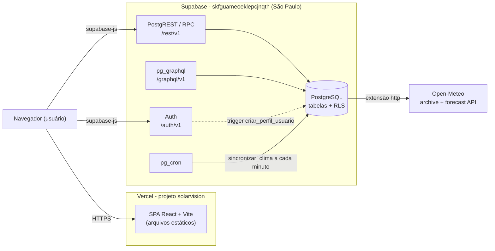
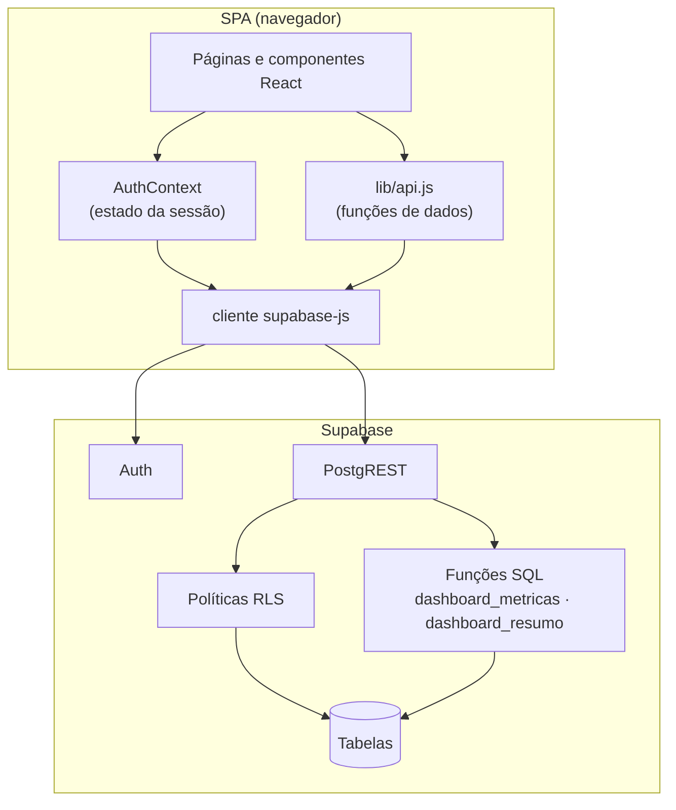
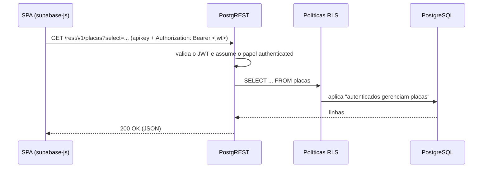
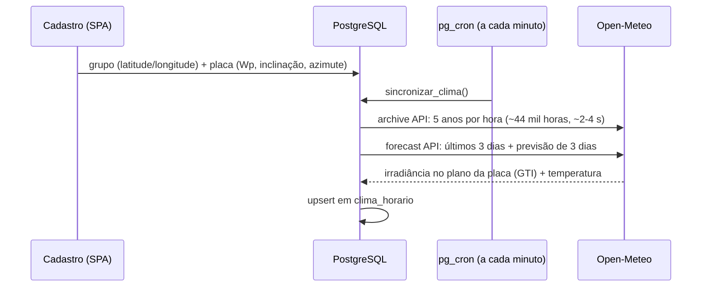

# Arquitetura - SolarVision

Documento de arquitetura do SolarVision. Trata da estrutura do sistema, da segurança, dos fluxos de comunicação, da stack tecnológica e das decisões de projeto.

> Modelo de dados: ver [MODELO-DE-CLASSES.md](MODELO-DE-CLASSES.md).
> Funcionalidades do sistema: ver [FUNCIONALIDADES.md](FUNCIONALIDADES.md).
> Até a migração, o backend era uma API Spring Boot em Docker Compose; o motivo da troca está em [DECISOES-TECNICAS.md](DECISOES-TECNICAS.md).

---

## 1. Visão geral

SolarVision é uma SPA React hospedada na **Vercel** que usa o **Supabase** como backend completo. Não existe servidor de aplicação próprio: a regra de acesso fica no banco (RLS) e as agregações em funções SQL.

| Componente | Responsabilidade |
|---|---|
| Vercel | Serve os arquivos estáticos da SPA; `vercel.json` reescreve qualquer rota para `index.html` |
| Supabase Auth | Cadastro, login, emissão e renovação do JWT; guarda a senha (hash) em `auth.users` |
| PostgREST (`/rest/v1`) | API REST gerada a partir das tabelas e funções do schema `public` |
| PostgreSQL | Tabelas do domínio, políticas RLS, trigger de perfil, funções do dashboard e do clima |
| pg_cron + extensão `http` | Job `sincronizar-clima`, a cada minuto: busca o clima das placas no Open-Meteo (seção 5) |
| pg_graphql (`/graphql/v1`) | GraphQL nativo do Supabase sobre as mesmas tabelas (substitui o Spring GraphQL) |
| Open-Meteo | API externa de clima, gratuita e sem chave: histórico (reanálise) e previsão por hora |

### Preparação do ambiente

1. Aplicar as migrations de `supabase/migrations/` (schema, RLS, trigger, funções e job). O workflow `supabase.yml` faz isso a cada push em `qa`/`production`.
2. Configurar `VITE_SUPABASE_URL` e `VITE_SUPABASE_PUBLISHABLE_KEY` na Vercel (ou em `frontend/.env.local`).

Não há carga de dados: o clima entra sozinho quando uma placa é cadastrada com local e especificações.

---

## 2. Camadas

Responsabilidades:

- **Páginas/componentes** - interface e estado de tela; não conhecem nomes de tabela.
- **`lib/api.js`** - única camada que monta consultas; usa aliases (`criadoEm:criado_em`) para manter o mesmo formato JSON que a API Spring Boot devolvia, então as telas não mudaram.
- **`AuthContext`** - escuta `onAuthStateChange`, expõe `login`, `register`, `logout` e o perfil do usuário.
- **RLS** - substitui o filtro de segurança: toda consulta passa pelas políticas da tabela.
- **Funções SQL (RPC)** - substituem o `DashboardService`: agregações por período e cards da Home.

---

## 3. Fluxo de uma consulta autenticada

Sem JWT a requisição usa o papel `anon`, que não tem nenhuma política RLS: leituras voltam vazias e escritas são recusadas.

---

## 4. Segurança

### Fluxo e componentes
- **Cadastro** (`supabase.auth.signUp`) envia o nome em `options.data.nome`; o trigger `criar_perfil_usuario` (security definer) cria a linha em `usuarios`.
- **Login** (`signInWithPassword`) devolve uma sessão com JWT de curta duração e refresh token; o `supabase-js` guarda a sessão no `localStorage` e renova o token sozinho.
- Toda chamada ao PostgREST leva o JWT; o banco identifica o usuário por `auth.uid()`.

### Mecanismos
| Mecanismo | Implementação |
|---|---|
| Token | JWT emitido e assinado pelo Supabase Auth |
| Senha | Hash gerenciado pelo Supabase Auth em `auth.users`; não existe coluna de senha em `public` |
| Autorização | RLS em todas as tabelas: autenticados gerenciam grupos/placas/limpezas, leem leituras e clima e leem apenas o próprio perfil |
| Funções | `execute` das funções do dashboard revogado de `public` e `anon`; as do clima (`sincronizar_clima`, `atualizar_clima_placa`, security definer) não são executáveis por nenhum papel do cliente, só pelo pg_cron |
| Chave do cliente | Chave **publicável** (pública por definição); a chave secreta/service role nunca vai para o frontend |
| Validação | Constraints `CHECK` no banco (nome/modelo não vazios, status válidos, observação até 1000 caracteres); `lib/api.js` traduz os erros para mensagens em português |
| Segredos | `VITE_SUPABASE_*` em `.env.local` (fora do Git) e nas variáveis da Vercel; a connection string do banco só no segredo `SUPABASE_DB_URL` do CI. O Open-Meteo não usa chave |

### Observações
- O papel `role` (ADMIN/USER) existe em `usuarios`, mas nenhuma política o considera ainda; ver [FEATURES-INCOMPLETAS.md](FEATURES-INCOMPLETAS.md).
- Se "Confirm email" estiver ligado no Supabase Auth, o cadastro não abre sessão e a tela pede a confirmação do e-mail.

---

## 5. Geração estimada pelo clima (Open-Meteo)

Os dados mocados do CSV (e o job que os deslocava para hoje) saíram do banco. A geração agora tem duas séries:

- **Medida** - `leituras_energia`, vinda de sensores; vazia até haver sensor (ESP32) ou API de inversor integrados.
- **Estimada** - calculada a partir do clima real do local de cada placa:

1. A placa entra na fila quando o grupo tem latitude/longitude e ela tem potência, inclinação e azimute (0 = Norte, 90 = Leste, 180 = Sul, 270 = Oeste; convertido para a convenção do Open-Meteo, 0 = Sul).
2. O job `sincronizar-clima` chama `sincronizar_clima()`, que processa até 5 placas por vez: placa nova recebe os 5 anos de histórico + previsão em ~1 min após o cadastro; as demais têm a previsão renovada de hora em hora. Uma falha só gera `warning` e não trava a fila; o histórico pendente é tentado de novo a cada 10 min.
3. `potencia_estimada()` converte cada hora de clima em potência: P = Wp × G/1000 × PR × [1 + γ(T_célula − 25)], com T_célula ≈ T_ar + G × (45 − 20)/800, PR = 0,82 e γ = `coef_temperatura` (padrão −0,40 %/°C).
4. `dashboard_metricas` devolve, por balde, `medida` e `estimada` (potência) e `medida_wh`/`estimada_wh` (energia), de todas as placas ou filtrando por grupo/placa; `dashboard_resumo` soma o estimado de hoje, a previsão de amanhã e a potência estimada agora.

Todas as agregações usam o fuso `America/Sao_Paulo` (o Supabase e o clima gravado ficam em UTC). Limitações em [FEATURES-INCOMPLETAS.md](FEATURES-INCOMPLETAS.md).

---

## 6. Stack tecnológica

| Camada | Tecnologia | Função |
|---|---|---|
| Frontend | React 19 + Vite 7 | SPA |
| Cliente de dados | `@supabase/supabase-js` | Auth, consultas REST e chamadas RPC |
| Gráficos / UI | ApexCharts, Bootstrap | Gráfico de geração e layout |
| Autenticação | Supabase Auth | Cadastro, login, JWT e refresh |
| API | PostgREST (Supabase) | REST gerado a partir do schema |
| API de consulta | pg_graphql (Supabase) | GraphQL nativo em `/graphql/v1` |
| Regras de negócio | PL/pgSQL / SQL | Funções do dashboard (`dashboard_metricas`, `dashboard_resumo`) e do clima (`sincronizar_clima`, `potencia_estimada`) |
| Banco | PostgreSQL (Supabase, São Paulo) | Armazenamento relacional + RLS |
| Agendamento | pg_cron | Sincronização do clima a cada minuto |
| Dados meteorológicos | Open-Meteo + extensão `http` | 5 anos de clima horário + previsão por placa |
| Hospedagem | Vercel | Build do Vite e CDN dos estáticos |
| CI | GitHub Actions | Testes e build do frontend; migrations + teste de ponta a ponta em `qa`/`production`; requisição diária contra a pausa do plano free |

---

## 7. Decisões de arquitetura

- **Backend como serviço.** Supabase cobre autenticação, API e banco; não há servidor para manter, empacotar ou escalar.
- **Segurança no banco.** As políticas RLS são a fonte única da regra de acesso, valendo para REST, GraphQL e qualquer outro cliente.
- **Migration como dono do schema.** `supabase/migrations/` versiona tabelas, políticas, funções e o job, no papel que era do Flyway.
- **Agregação no banco.** O dashboard roda como função SQL (`date_trunc` + `avg`) e devolve só os pontos do gráfico, sem trafegar as leituras.
- **Integração externa dentro do banco.** O clima é buscado pelo próprio PostgreSQL (`http` + pg_cron), então continua tudo em migrations aplicadas pelo CI (ver [DECISOES-TECNICAS.md](DECISOES-TECNICAS.md#7-geração-estimada-pelo-clima-open-meteo)).
- **Formato JSON preservado.** `lib/api.js` usa aliases para que as telas recebam os mesmos campos da API antiga.
- **Um projeto Supabase para QA e produção.** Simplifica o ambiente acadêmico; o custo é dado compartilhado entre os ambientes (ver [DECISOES-TECNICAS.md](DECISOES-TECNICAS.md)).
