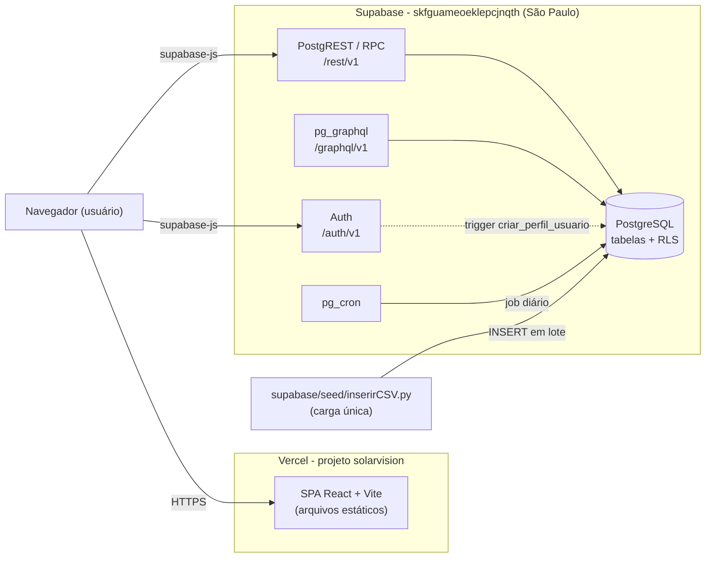
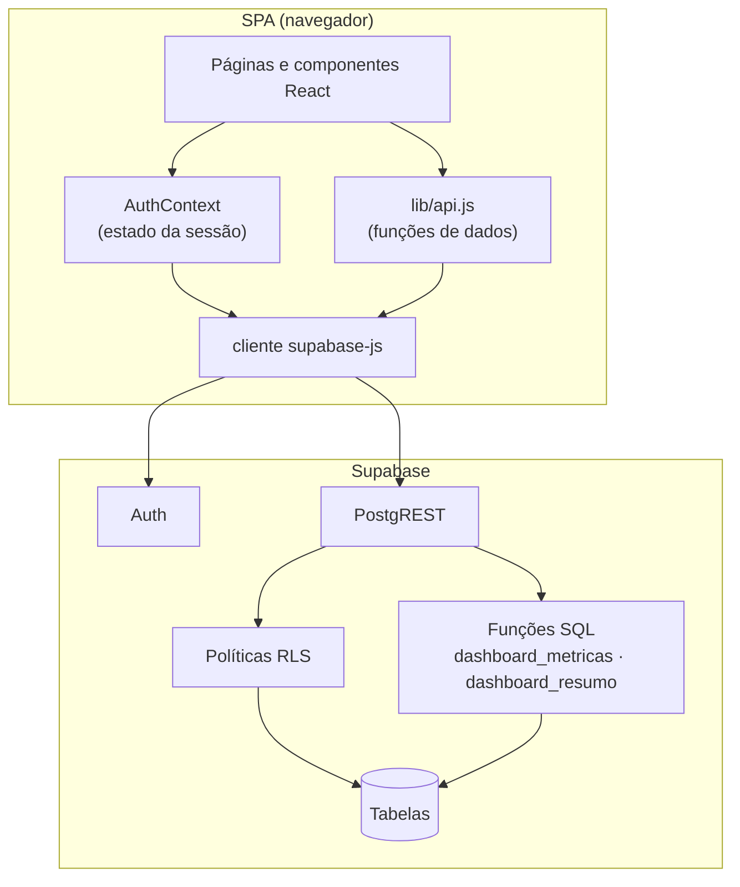
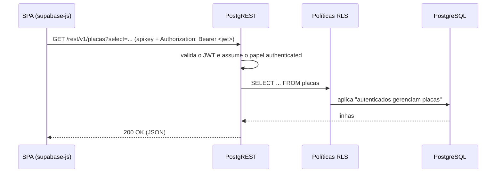

# Arquitetura - SolarVision

Documento de arquitetura do SolarVision. Trata da estrutura do sistema, da segurança, dos fluxos de comunicação, da stack tecnológica e das decisões de projeto.

> Modelo de dados: ver [MODELO-DE-CLASSES.md](MODELO-DE-CLASSES.md).
> Funcionalidades do sistema: ver [FUNCIONALIDADES.md](FUNCIONALIDADES.md).
> Até a migração, o backend era uma API Spring Boot em Docker Compose; o motivo da troca está em [DECISOES-TECNICAS.md](DECISOES-TECNICAS.md).

---

## 1. Visão geral

SolarVision é uma SPA React hospedada na **Vercel** que usa o **Supabase** como backend completo. Não existe servidor de aplicação próprio: a regra de acesso fica no banco (RLS) e as agregações em funções SQL.

| Componente | Responsabilidade |
|---|---|
| Vercel | Serve os arquivos estáticos da SPA; `vercel.json` reescreve qualquer rota para `index.html` |
| Supabase Auth | Cadastro, login, emissão e renovação do JWT; guarda a senha (hash) em `auth.users` |
| PostgREST (`/rest/v1`) | API REST gerada a partir das tabelas e funções do schema `public` |
| PostgreSQL | Tabelas do domínio, políticas RLS, trigger de perfil e funções do dashboard |
| pg_cron | Job `deslocar-leituras-para-hoje`, todo dia às 00:05 de Brasília (03:05 UTC) |
| pg_graphql (`/graphql/v1`) | GraphQL nativo do Supabase sobre as mesmas tabelas (substitui o Spring GraphQL) |
| `inserirCSV.py` | Importa o CSV de leituras uma vez, via connection string do Session pooler |

### Preparação do ambiente

1. Aplicar `supabase/migrations/20261006120000_init.sql` (schema, RLS, trigger, funções e job).
2. Rodar `inserirCSV.py` com `DATABASE_URL` para carregar `leituras_energia`.
3. Configurar `VITE_SUPABASE_URL` e `VITE_SUPABASE_PUBLISHABLE_KEY` na Vercel (ou em `frontend/.env.local`).

---

## 2. Camadas

Responsabilidades:

- **Páginas/componentes** - interface e estado de tela; não conhecem nomes de tabela.
- **`lib/api.js`** - única camada que monta consultas; usa aliases (`criadoEm:criado_em`) para manter o mesmo formato JSON que a API Spring Boot devolvia, então as telas não mudaram.
- **`AuthContext`** - escuta `onAuthStateChange`, expõe `login`, `register`, `logout` e o perfil do usuário.
- **RLS** - substitui o filtro de segurança: toda consulta passa pelas políticas da tabela.
- **Funções SQL (RPC)** - substituem o `DashboardService`: agregações por período e cards da Home.

---

## 3. Fluxo de uma consulta autenticada

Sem JWT a requisição usa o papel `anon`, que não tem nenhuma política RLS: leituras voltam vazias e escritas são recusadas.

---

## 4. Segurança

### Fluxo e componentes
- **Cadastro** (`supabase.auth.signUp`) envia o nome em `options.data.nome`; o trigger `criar_perfil_usuario` (security definer) cria a linha em `usuarios`.
- **Login** (`signInWithPassword`) devolve uma sessão com JWT de curta duração e refresh token; o `supabase-js` guarda a sessão no `localStorage` e renova o token sozinho.
- Toda chamada ao PostgREST leva o JWT; o banco identifica o usuário por `auth.uid()`.

### Mecanismos
| Mecanismo | Implementação |
|---|---|
| Token | JWT emitido e assinado pelo Supabase Auth |
| Senha | Hash gerenciado pelo Supabase Auth em `auth.users`; não existe coluna de senha em `public` |
| Autorização | RLS em todas as tabelas: autenticados gerenciam grupos/placas/limpezas, leem leituras e leem apenas o próprio perfil |
| Funções | `execute` das funções do dashboard revogado de `public` e `anon` |
| Chave do cliente | Chave **publicável** (pública por definição); a chave secreta/service role nunca vai para o frontend |
| Validação | Constraints `CHECK` no banco (nome/modelo não vazios, status válidos, observação até 1000 caracteres); `lib/api.js` traduz os erros para mensagens em português |
| Segredos | `VITE_SUPABASE_*` em `.env.local` (fora do Git) e nas variáveis da Vercel; `DATABASE_URL` só na máquina de quem roda o seeder |

### Observações
- O papel `role` (ADMIN/USER) existe em `usuarios`, mas nenhuma política o considera ainda; ver [FEATURES-INCOMPLETAS.md](FEATURES-INCOMPLETAS.md).
- Se "Confirm email" estiver ligado no Supabase Auth, o cadastro não abre sessão e a tela pede a confirmação do e-mail.

---

## 5. Dados em "tempo real"

O CSV de leituras é histórico. Para o gráfico sempre terminar no dia atual:

1. `inserirCSV.py` desloca as datas por dias inteiros (`hoje - última data do CSV`), preservando a hora do dia.
2. O job pg_cron `deslocar-leituras-para-hoje` repete o deslocamento todo dia às 00:05 (horário de Brasília), fazendo o papel que antes era de cada `docker compose up`.

Todas as agregações usam o fuso `America/Sao_Paulo` (o Supabase roda em UTC).

---

## 6. Stack tecnológica

| Camada | Tecnologia | Função |
|---|---|---|
| Frontend | React 19 + Vite 7 | SPA |
| Cliente de dados | `@supabase/supabase-js` | Auth, consultas REST e chamadas RPC |
| Gráficos / UI | ApexCharts, Bootstrap | Gráfico de geração e layout |
| Autenticação | Supabase Auth | Cadastro, login, JWT e refresh |
| API | PostgREST (Supabase) | REST gerado a partir do schema |
| API de consulta | pg_graphql (Supabase) | GraphQL nativo em `/graphql/v1` |
| Regras de negócio | PL/pgSQL / SQL | Funções `dashboard_metricas` e `dashboard_resumo` |
| Banco | PostgreSQL (Supabase, São Paulo) | Armazenamento relacional + RLS |
| Agendamento | pg_cron | Deslocamento diário das leituras |
| Carga de dados | Python + psycopg2 | Importação do CSV |
| Hospedagem | Vercel | Build do Vite e CDN dos estáticos |
| CI | GitHub Actions | Testes e build do frontend |

---

## 7. Decisões de arquitetura

- **Backend como serviço.** Supabase cobre autenticação, API e banco; não há servidor para manter, empacotar ou escalar.
- **Segurança no banco.** As políticas RLS são a fonte única da regra de acesso, valendo para REST, GraphQL e qualquer outro cliente.
- **Migration como dono do schema.** `supabase/migrations/` versiona tabelas, políticas, funções e o job, no papel que era do Flyway.
- **Agregação no banco.** O dashboard roda como função SQL (`date_trunc` + `avg`) e devolve só os pontos do gráfico, sem trafegar as leituras.
- **Formato JSON preservado.** `lib/api.js` usa aliases para que as telas recebam os mesmos campos da API antiga.
- **Um projeto Supabase para QA e produção.** Simplifica o ambiente acadêmico; o custo é dado compartilhado entre os ambientes (ver [DECISOES-TECNICAS.md](DECISOES-TECNICAS.md)).
