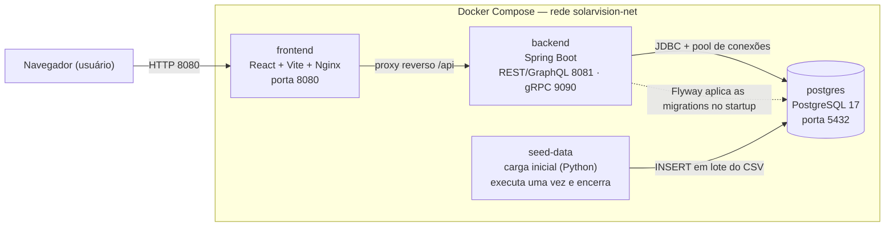
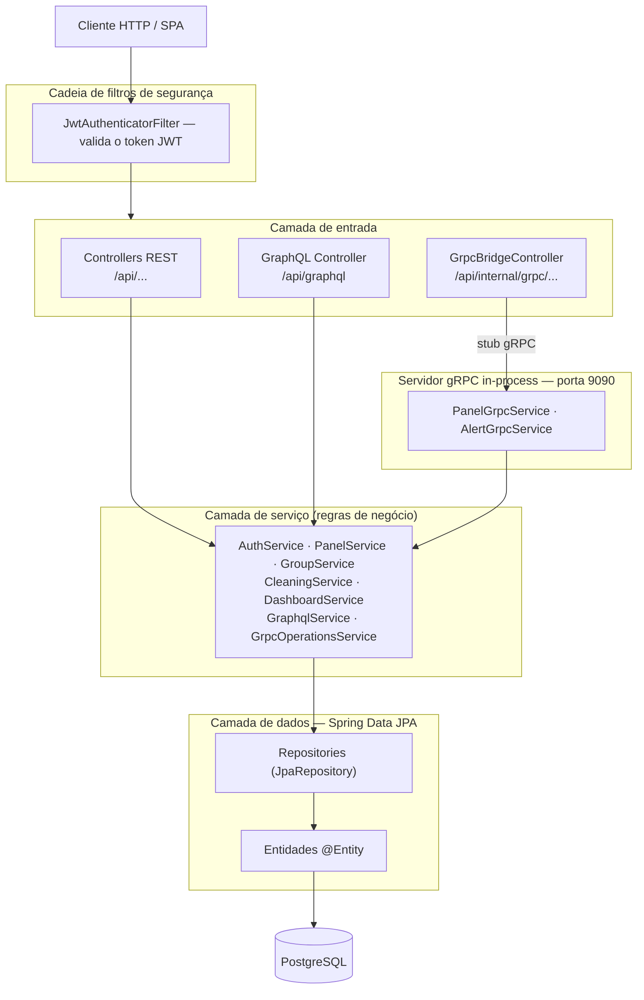
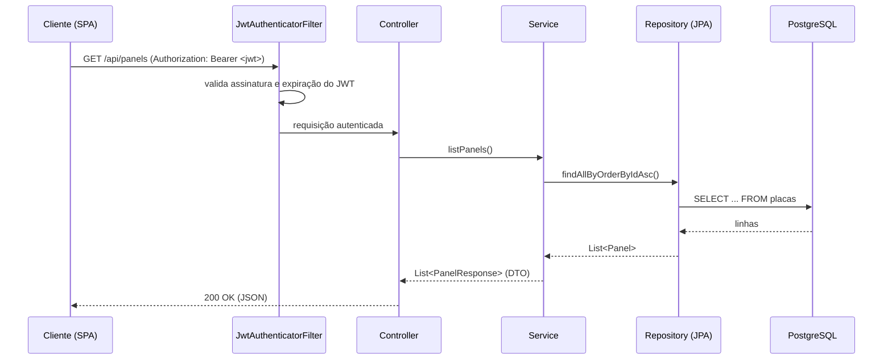
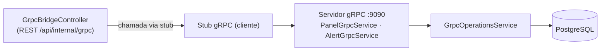

# Arquitetura — SolarVision

Documento de arquitetura do SolarVision. Trata da estrutura do sistema, das camadas, dos fluxos de comunicação, da stack tecnológica e das decisões de projeto.

> Modelo de domínio e diagrama de classes: ver [MODELO-DE-CLASSES.md](MODELO-DE-CLASSES.md).
> Funcionalidades do sistema: ver [FUNCIONALIDADES.md](FUNCIONALIDADES.md).

---

## 1. Visão geral

SolarVision é um sistema full-stack de monitoramento de energia solar, organizado em serviços orquestrados por Docker Compose:



| Serviço | Responsabilidade | Porta |
|---|---|---|
| `postgres` | Banco de dados relacional | 5432 |
| `backend` | API REST + GraphQL + servidor gRPC | 8081 / 9090 |
| `frontend` | SPA React servida por Nginx (proxy de `/api`) | 8080 |
| `seed-data` | Importa o CSV de leituras e encerra | — |

### Ordem de inicialização

1. `postgres` sobe vazio.
2. `backend` conecta e o **Flyway** cria todo o schema aplicando as migrations.
3. `seed-data` aguarda o schema existir, importa o CSV para `leituras_energia` e encerra.
4. `frontend` (Nginx) serve a SPA e faz proxy reverso de `/api` para o backend.

---

## 2. Arquitetura em camadas do backend

O backend segue uma arquitetura em camadas com responsabilidades isoladas: cada camada conhece apenas a camada imediatamente abaixo.



Responsabilidades:

- **Controller** — expõe os endpoints e traduz HTTP ↔ objetos Java. Sem regra de negócio.
- **Service** — concentra as regras de negócio e define a fronteira transacional (`@Transactional`).
- **Repository** — acesso a dados via Spring Data JPA; a implementação é gerada pelo framework a partir da interface.
- **Entity** — classe mapeada para uma tabela do banco.
- **Filtro de segurança** — intercepta toda requisição, valida o JWT e popula o contexto de autenticação.

---

## 3. Fluxo de uma requisição REST autenticada



A autenticação é **stateless**: não há sessão no servidor. O JWT assinado carrega a identidade do usuário e é validado a cada requisição pela chave secreta (HMAC).

---

## 4. Comunicação gRPC (in-process)

O backend expõe um servidor gRPC interno na porta 9090 e atua, ele mesmo, como cliente — demonstrando a comunicação ponta a ponta dentro do JVM.



O contrato é definido em arquivos `.proto` (Protobuf); o plugin de build gera as classes Java (stubs). Os serviços executam operações reais no banco via JPA (checagem de placa com registro de leitura, geração de alerta, simulação de envio de e-mail).

---

## 5. Stack tecnológica

| Camada | Tecnologia | Função |
|---|---|---|
| Linguagem / runtime | Java 25 | Linguagem do backend |
| Framework | Spring Boot 3.5.12 | Auto-configuração + servidor web embutido (Tomcat) |
| Build | Maven (+ Dockerfile multi-stage) | Dependências e empacotamento |
| Persistência | Spring Data JPA / Hibernate | ORM objeto ↔ tabela |
| Migrations | Flyway | Versionamento do schema do banco |
| Banco | PostgreSQL 17 | Armazenamento relacional |
| Segurança | Spring Security + JWT (jjwt) + BCrypt | Autenticação stateless e hash de senha |
| API REST | Spring Web | Endpoints HTTP |
| API de consulta | Spring GraphQL | Consultas com seleção de campos |
| RPC interno | Spring gRPC + Protobuf | Comunicação binária via HTTP/2 |
| Documentação | springdoc-openapi (Swagger UI) | Documentação e teste da API |
| Frontend | React + Vite + Nginx | SPA e proxy reverso |
| Carga de dados | Python + psycopg2 | Importação do CSV de leituras |
| Infra | Docker Compose | Orquestração dos serviços |

### Como as principais tecnologias funcionam

- **Spring Boot** empacota a aplicação com um servidor web embutido; o artefato final é um JAR executável (`java -jar`).
- **Spring Data JPA / Hibernate** é a camada de ORM: cada `@Entity` mapeia uma tabela e os repositories transformam chamadas de método em SQL. Consultas mais elaboradas usam `@Query` (JPQL ou SQL nativo). `@Transactional` delimita a transação (commit/rollback automáticos).
- **Flyway** aplica migrations versionadas (`V1__`, `V2__`), ordenadas, idempotentes e registradas em uma tabela de histórico. É a fonte única de verdade do schema. O Hibernate roda em modo `validate` (apenas confere o mapeamento, não altera o schema).
- **Spring Security + JWT** processa cada requisição em uma cadeia de filtros; o JWT é um token assinado e sem estado, validado por chave secreta. Senhas são armazenadas como hash BCrypt (com salt).
- **GraphQL** oferece um endpoint único onde o cliente declara exatamente os campos desejados, reduzindo chamadas e tráfego.
- **gRPC + Protobuf** usa um contrato `.proto` e geração de código; a serialização binária sobre HTTP/2 é mais compacta e rápida que JSON, adequada à comunicação entre serviços.
- **springdoc-openapi** inspeciona os controllers e gera a especificação OpenAPI (`/v3/api-docs`) e a interface interativa (`/swagger-ui.html`).

---

## 6. Decisões de arquitetura

- **Spring Data JPA como persistência única.** O projeto adota JPA/Hibernate em toda a camada de dados, em vez de acesso JDBC manual, padronizando o mapeamento objeto-relacional.
- **Flyway como dono do schema.** A criação e evolução do banco ficam versionadas no repositório, e não em scripts de init do contêiner; o Hibernate apenas valida.
- **Autenticação stateless com JWT.** Sem sessão de servidor, facilitando escala horizontal.
- **DTOs nas bordas.** Controllers e services trafegam DTOs (records), nunca expõem entidades diretamente.
- **Tratamento de erros centralizado.** Um handler global converte exceções de negócio em respostas HTTP consistentes.
- **gRPC in-process.** O servidor gRPC roda no mesmo processo do backend, demonstrando o padrão sem introduzir um contêiner adicional.
- **Spring gRPC em versão milestone (0.9.0).** Necessário para manter compatibilidade com o Spring Boot 3.5 — ver seção 7.

---

## 7. Dependência gRPC (Spring gRPC — versão milestone)

O suporte a gRPC vem do projeto oficial **Spring gRPC**, que **não** é gerenciado pelo BOM do Spring Boot — por isso a versão é declarada explicitamente no `pom.xml`.

### Por que a versão 0.9.0 (e não a 1.0.x GA)

- O **Spring gRPC 1.0.x exige Spring Boot 4.0.x**. Este projeto está em **Spring Boot 3.5.12**, cuja linha compatível é a **0.9.0**.
- A `0.9.0` é distribuída pelo repositório **Spring Milestones** (não está no Maven Central como release GA). Por isso o `pom.xml` declara o repositório:

```xml
<repositories>
  <repository>
    <id>spring-milestones</id>
    <url>https://repo.spring.io/milestone</url>
    <snapshots><enabled>false</enabled></snapshots>
  </repository>
</repositories>
```

### Alinhamento do gerador de código com o runtime

O plugin que gera as classes Java a partir dos `.proto` precisa usar **as mesmas versões** de Protobuf e gRPC que o BOM do Spring gRPC 0.9.0 coloca em runtime. Caso contrário, o código gerado chama APIs que não existem nas bibliotecas em execução (erro de compilação, p. ex. `com.google.protobuf.Generated` ou `blockingV2UnaryCall`). As versões abaixo vêm do BOM `spring-grpc-dependencies:0.9.0`:

| Componente | Versão (BOM 0.9.0) | Propriedade no `pom.xml` |
|---|---|---|
| Spring gRPC | 0.9.0 | `spring-grpc.version` |
| protobuf-java (runtime) | 4.30.2 | `protoc.version` (gerador `protoc`) |
| grpc-java (runtime) | 1.72.0 | `grpc-java-plugin.version` (gerador `protoc-gen-grpc-java`) |

### Implicações e manutenção

- É uma dependência **não-GA (milestone)**: aceitável para o escopo deste projeto, mas as versões devem permanecer **fixadas** (como estão) e ser revisadas em qualquer atualização.
- **Ao migrar para Spring Boot 4.x**: trocar o Spring gRPC para a linha **1.0.x (GA)**, realinhar `protoc.version`/`grpc-java-plugin.version` às versões do novo BOM e **remover** o repositório Spring Milestones (a dependência passa a estar no Maven Central).

---

## 8. Estrutura de pastas (backend)

```text
backend/
├── data-seeder/                 # carga inicial do CSV (Python)
├── src/main/java/br/com/solarvision/api
│   ├── config/                  # OpenApiConfig (Swagger)
│   ├── controller/              # REST + ponte REST→gRPC
│   │   └── graphql/             # controller GraphQL
│   ├── exception/               # exceções + handler global
│   ├── grpc/
│   │   ├── client/              # stubs gRPC (cliente)
│   │   └── server/              # @GrpcService (servidor)
│   ├── model/                   # entidades JPA + DTOs + enums
│   ├── repository/              # Spring Data JPA
│   ├── security/                # filtro JWT, config de segurança
│   └── service/                 # regras de negócio
├── src/main/proto/              # contratos gRPC (.proto)
├── src/main/resources/
│   ├── application.yml
│   ├── db/migration/            # migrations Flyway (V1, V2, ...)
│   └── graphql/schema.graphqls
├── src/test/java/               # testes unitários (JUnit 5 + Mockito)
├── Dockerfile                   # build multi-stage
└── pom.xml
```
