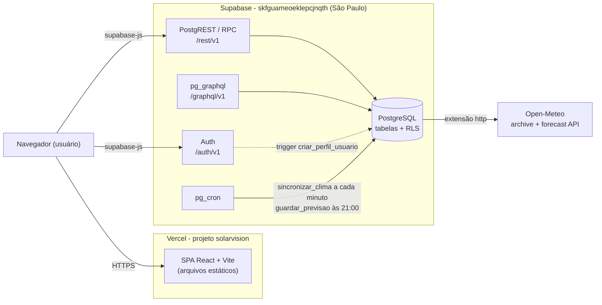
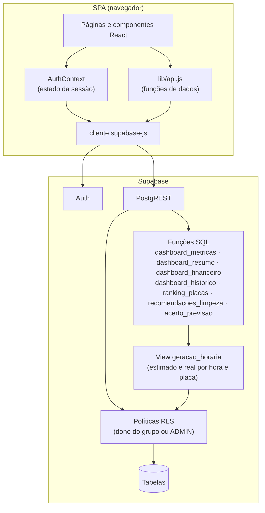
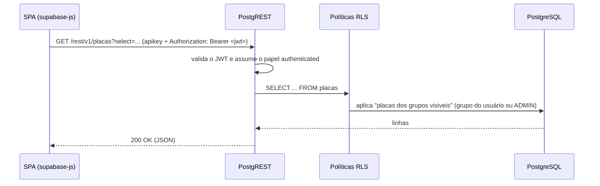
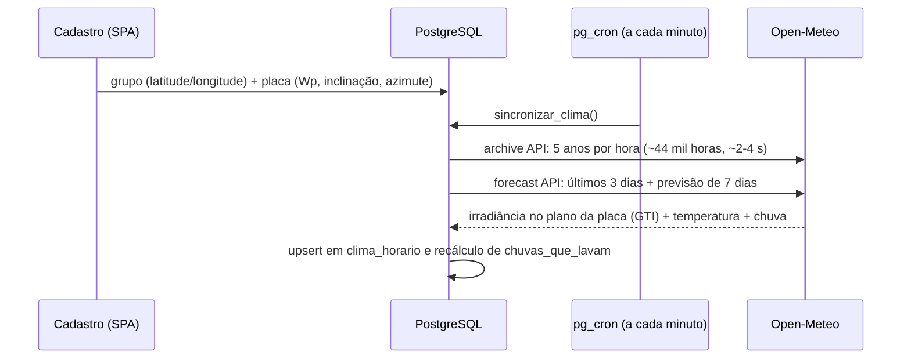

# Arquitetura - SolarVision

Documento de arquitetura do SolarVision. Trata da estrutura do sistema, da segurança, dos fluxos de comunicação, da stack tecnológica e das decisões de projeto.

> Modelo de dados: ver [MODELO-DE-CLASSES.md](MODELO-DE-CLASSES.md).
> Funcionalidades do sistema: ver [FUNCIONALIDADES.md](FUNCIONALIDADES.md).
> Até a migração, o backend era uma API Spring Boot em Docker Compose; o motivo da troca está em [DECISOES-TECNICAS.md](DECISOES-TECNICAS.md).

---

## 1. Visão geral

SolarVision é uma SPA React hospedada na **Vercel** que usa o **Supabase** como backend completo. Não existe servidor de aplicação próprio: a regra de acesso fica no banco (RLS) e as agregações em funções SQL.

| Componente | Responsabilidade |
|---|---|
| Vercel | Serve os arquivos estáticos da SPA; `vercel.json` reescreve qualquer rota para `index.html` |
| Supabase Auth | Cadastro, login, emissão e renovação do JWT; guarda a senha (hash) em `auth.users` |
| PostgREST (`/rest/v1`) | API REST gerada a partir das tabelas e funções do schema `public` |
| PostgreSQL | Tabelas do domínio, políticas RLS (cada usuário só vê as próprias usinas), triggers, view `geracao_horaria` e funções do dashboard e do clima |
| pg_cron + extensão `http` | Job `sincronizar-clima`, a cada minuto: busca o clima e a chuva das placas no Open-Meteo (seção 5); job `guardar-previsao`, às 21:00 de São Paulo: guarda a previsão de amanhã para medir o acerto; job `gerar-alertas`, às 07:00 de São Paulo: grava os alertas do dia (`gerar_alertas()`) |
| pg_graphql (`/graphql/v1`) | GraphQL nativo do Supabase sobre as mesmas tabelas (substitui o Spring GraphQL) |
| Open-Meteo | API externa de clima, gratuita e sem chave: histórico (reanálise) e previsão por hora |

### Preparação do ambiente

1. Aplicar as migrations de `supabase/migrations/` (schema, RLS, triggers, view, funções e jobs). O workflow `supabase.yml` faz isso a cada push em `qa`/`production`.
2. Configurar `VITE_SUPABASE_URL` e `VITE_SUPABASE_PUBLISHABLE_KEY` na Vercel (ou em `frontend/.env.local`).
3. (Opcional) Promover um administrador, que vê as usinas de todos: no SQL Editor, `update public.usuarios set role = 'ADMIN' where email = '...';`. Não há tela para isso.

Não há carga de dados: o clima entra sozinho quando uma placa é cadastrada com local e especificações; leituras reais entram pela importação de CSV no Monitoramento.

---

## 2. Camadas

Responsabilidades:

- **Páginas/componentes** - interface e estado de tela; não conhecem nomes de tabela.
- **`lib/api.js`** - única camada que monta consultas; usa aliases (`criadoEm:criado_em`) para manter o mesmo formato JSON que a API Spring Boot devolvia, então as telas não mudaram.
- **`AuthContext`** - escuta `onAuthStateChange`, expõe `login`, `register`, `logout` e o perfil do usuário.
- **RLS** - substitui o filtro de segurança: toda consulta passa pelas políticas da tabela.
- **View `geracao_horaria`** - fonte única da geração por hora e por placa (estimado pelo clima e real medido ou simulado); `security_invoker`, então respeita a RLS de quem consulta.
- **Funções SQL (RPC)** - substituem o `DashboardService`: agregações por período, cards da Home e as análises (valores em R$/CO₂, média de 5 anos, ranking de placas, recomendação de limpeza e acerto da previsão), todas sobre `geracao_horaria`.

---

## 3. Fluxo de uma consulta autenticada

Sem JWT a requisição usa o papel `anon`, que não tem nenhuma política RLS: leituras voltam vazias e escritas são recusadas. Com JWT, cada usuário só recebe as linhas dos próprios grupos (ou de todos, se for ADMIN).

---

## 4. Segurança

### Fluxo e componentes
- **Cadastro** (`supabase.auth.signUp`) envia o nome em `options.data.nome`; o trigger `criar_perfil_usuario` (security definer) cria a linha em `usuarios`.
- **Login** (`signInWithPassword`) devolve uma sessão com JWT de curta duração e refresh token; o `supabase-js` guarda a sessão no `localStorage` e renova o token sozinho.
- Toda chamada ao PostgREST leva o JWT; o banco identifica o usuário por `auth.uid()`.

### Mecanismos
| Mecanismo | Implementação |
|---|---|
| Token | JWT emitido e assinado pelo Supabase Auth |
| Senha | Hash gerenciado pelo Supabase Auth em `auth.users`; não existe coluna de senha em `public` |
| Autorização | RLS em todas as tabelas. Grupos: só o dono (`dono_id = auth.uid()`, preenchido sozinho ao criar) ou um ADMIN (`e_admin()`). Placas, limpezas e leituras (escrita pelo dono) e clima, chuvas e previsões (só leitura) herdam pelo grupo, com políticas `placa_id in (select id from placas)`. Perfil: só a própria linha |
| Funções | `execute` das funções do dashboard revogado de `public` e `anon`; as funções rodam com os direitos de quem chama (a RLS filtra). As do clima e da previsão (`sincronizar_clima`, `atualizar_clima_placa`, `guardar_previsao`, security definer) não são executáveis por nenhum papel do cliente, só pelo pg_cron |
| Exceção: `perda_sujeira_em` | Security definer por desempenho (roda por hora e por placa; com RLS, cada chamada refazia placas → grupos → `e_admin()`: 14 s na visão Ano). Repete a regra do dono dentro da função (placa de outro dono devolve null); se a política dos grupos mudar, ela precisa mudar junto |
| Chave do cliente | Chave **publicável** (pública por definição); a chave secreta/service role nunca vai para o frontend |
| Validação | Constraints `CHECK` no banco (nome/modelo não vazios, status válidos, observação até 1000 caracteres); `lib/api.js` traduz os erros para mensagens em português |
| Segredos | `VITE_SUPABASE_*` em `.env.local` (fora do Git) e nas variáveis da Vercel; a connection string do banco só no segredo `SUPABASE_DB_URL` do CI. O Open-Meteo não usa chave |

### Observações
- `role = 'ADMIN'` em `usuarios` vê e altera os grupos (e tudo que pende deles) de todos os usuários; a promoção é só por SQL (`update usuarios set role = 'ADMIN' ...`). O perfil (`usuarios`) continua visível só para o próprio usuário, inclusive para o ADMIN; o usuário altera só o próprio `nome` e as preferências (política de update na própria linha + grant por coluna: `role` e `email` nunca); ver [FEATURES-INCOMPLETAS.md](FEATURES-INCOMPLETAS.md).
- Os grupos que existiam antes do dono por grupo (migration `20261008090000`) ficaram com o **primeiro usuário cadastrado**; para passá-los a outro, `update grupos_solares set dono_id = ...` por SQL.
- Se "Confirm email" estiver ligado no Supabase Auth, o cadastro não abre sessão e a tela pede a confirmação do e-mail.

---

## 5. Geração estimada pelo clima (Open-Meteo)

Os dados mocados do CSV (e o job que os deslocava para hoje) saíram do banco. A geração tem duas séries, ambas calculadas por hora e por placa na view `geracao_horaria`:

- **Real** - nas horas já completas: a energia **medida** das leituras importadas (seção 5.2), se a hora tiver leituras; senão, **simulada** = estimado × (1 − perda por sujeira). A perda (`perda_sujeira_em`) cresce 0,2 %/dia, até 20 %, desde o evento mais recente que limpou a placa: limpeza registrada, chuva que lava (seção 5.1) ou a data de instalação; sem nenhum deles, está no limite.
- **Estimada** - calculada a partir do clima do local de cada placa, com a previsão do tempo:

1. A placa entra na fila quando o grupo tem latitude/longitude e ela tem potência, inclinação e azimute (0 = Norte, 90 = Leste, 180 = Sul, 270 = Oeste; convertido para a convenção do Open-Meteo, 0 = Sul).
2. O job `sincronizar-clima` chama `sincronizar_clima()`, que processa até 5 placas por vez: placa nova recebe os 5 anos de histórico + previsão em ~1 min após o cadastro; as demais têm a previsão renovada de hora em hora. Uma falha só gera `warning` e não trava a fila; o histórico pendente é tentado de novo a cada 10 min.
3. **Edição recarrega o clima.** Os triggers `ao_mudar_orientacao_placa` (inclinação, azimute ou troca de grupo) e `ao_mudar_local_grupo` (latitude/longitude, para todas as placas do grupo) zeram `clima_historico_em`/`clima_atualizado_em`; a placa volta à fila e o upsert sobrescreve as horas em ~1 min. Horas fora da nova janela de 5 anos ficam com o clima antigo.
4. `potencia_estimada()` converte cada hora de clima em potência: P = Wp × G/1000 × PR × [1 + γ(T_célula − 25)], com T_célula ≈ T_ar + G × (45 − 20)/800, PR = 0,82 e γ = `coef_temperatura` (padrão −0,40 %/°C). A validação com dados reais está em [validacao/RESULTADO.md](validacao/RESULTADO.md).
5. `dashboard_metricas` devolve, por balde, `medida` (real, só até a última hora completa) e `estimada` (potência), `medida_wh`/`estimada_wh` (energia) e `medida_sensor_wh` (parte do real que veio de leituras), de todas as placas ou filtrando por grupo/placa; `dashboard_resumo` soma o real (`totalGeradoHoje`, com `geradoHojeSensor`) e o estimado de hoje, a previsão de amanhã e a potência estimada agora.

Todas as agregações usam o fuso `America/Sao_Paulo` (o Supabase e o clima gravado ficam em UTC). Limitações em [FEATURES-INCOMPLETAS.md](FEATURES-INCOMPLETAS.md).

### 5.1 Chuva que lava as placas

`atualizar_clima_placa` também pede a chuva (`precipitation`) e grava `clima_horario.precipitacao`. Depois de cada carga, recalcula `chuvas_que_lavam` a partir do primeiro dia recebido: dia (fuso de São Paulo) com **≥ 5 mm** lava a placa, que fica limpa no fim do dia. A tabela inclui os dias da previsão, usados pela recomendação de limpeza; a perda por sujeira só considera chuvas de dias anteriores ao instante. O deploy da migration `20261008110000` devolveu à fila o histórico de todas as placas, para carregar a chuva dos 5 anos.

### 5.2 Geração real importada (CSV)

No Monitoramento, com uma placa selecionada, **Importar leituras (CSV)** lê o arquivo no navegador (`lib/leituras.js`): separador `,` ou `;`, vírgula decimal, data `aaaa-mm-dd` ou `dd/mm/aaaa` com a hora na mesma coluna ou em outra, horário de São Paulo (UTC−3 fixo) salvo fuso explícito no arquivo. As colunas são adivinhadas pelo nome e podem ser trocadas; a tela mostra uma prévia e grava em lotes de 5000 com upsert por `(placa_id, data_hora)` (reimportar não duplica). Só o dono do grupo (ou ADMIN) grava leituras.

Na view, cada leitura é a potência média do intervalo que começa no seu instante; a energia da hora é Σ W × intervalo, com o intervalo inferido pelo espaçamento das leituras na hora (limitado a 60 min ÷ nº de leituras). A hora com leituras usa o medido no lugar do simulado (`real_medido = true`).

### 5.3 Análises

Todas sobre `geracao_horaria`, executáveis só por `authenticated` e filtradas pela RLS:

| Função | O que devolve |
|---|---|
| `dashboard_financeiro(data_inicio, data_fim, grupo, placa)` | Energia real, economia em R$ (real × `tarifa_kwh`, só grupos com tarifa), perda por sujeira em kWh e R$ (estimado − real nas horas com real), CO₂ evitado (real × 0,0385 kgCO₂/kWh, fator médio do SIN de 2023, MCTI) e quantas placas estão sem tarifa |
| `recomendacoes_limpeza()` | Por placa: perda atual, kWh e R$ perdidos na próxima semana sem limpar (estimado da previsão × perda atual), chuva que lava prevista, em quantos dias a limpeza (`custo_limpeza`) se paga e a decisão: limpar se perda ≥ o `limiar_limpeza` do dono (padrão 10 %), sem chuva que lava nos próximos 3 dias e sem custo informado ou pagando-se em até 30 dias; `motivo` em texto |
| `dashboard_historico(granularidade, data_inicio, data_fim, grupo, placa)` | Média, mínimo e máximo do **estimado** (só o clima) da mesma janela nos 5 anos anteriores, com os mesmos `x` do `dashboard_metricas`; um ano só entra se todas as placas têm clima na janela inteira (o 5º costuma ser parcial) |
| `acerto_previsao(dias, grupo, placa)` | Por dia encerrado: a previsão guardada na véspera em `previsoes_diarias` (job `guardar-previsao`, 21:00 de São Paulo) x o estimado com o clima que aconteceu |
| `ranking_placas(data_inicio, data_fim, grupo)` | Por placa: real, estimado das horas com real, kWh/kWp, desempenho (real ÷ estimado), mediana do desempenho no grupo e `anomalia` (mais de 10 p.p. abaixo da mediana, em grupo com 2+ placas) |

**Alertas.** `gerar_alertas()` (security definer, só o pg_cron executa) grava em `alertas` três situações que as funções acima já detectam: limpeza recomendada (`recomendacoes_limpeza` com `limpar`), desempenho abaixo do grupo (`ranking_placas` dos últimos 7 dias com `anomalia`) e previsão baixa (amanhã abaixo do `limiar_previsao` do dono, padrão 60 %, da média de 5 anos do grupo para o dia, por `dashboard_historico`), respeitando os tipos que cada dono desligou. O unique `(grupo_id, placa_id, tipo, referencia)` evita repetição: previsão baixa no máximo uma por dia; limpeza e desempenho no máximo uma por semana enquanto a situação durar. O dono só lê e marca como lido (grant de update só em `lido_em`).

---

## 6. Stack tecnológica

| Camada | Tecnologia | Função |
|---|---|---|
| Frontend | React 19 + Vite 7 | SPA |
| Cliente de dados | `@supabase/supabase-js` | Auth, consultas REST e chamadas RPC |
| Gráficos / UI | ApexCharts, Bootstrap | Gráfico de geração e layout |
| Autenticação | Supabase Auth | Cadastro, login, JWT e refresh |
| API | PostgREST (Supabase) | REST gerado a partir do schema |
| API de consulta | pg_graphql (Supabase) | GraphQL nativo em `/graphql/v1` |
| Regras de negócio | PL/pgSQL / SQL | View `geracao_horaria`, funções do dashboard e das análises (`dashboard_metricas`, `dashboard_resumo`, `dashboard_financeiro`, `dashboard_historico`, `ranking_placas`, `recomendacoes_limpeza`, `acerto_previsao`) e do clima (`sincronizar_clima`, `potencia_estimada`, `perda_sujeira_em`) |
| Banco | PostgreSQL (Supabase, São Paulo) | Armazenamento relacional + RLS por dono do grupo |
| Agendamento | pg_cron | Sincronização do clima a cada minuto; previsão de amanhã guardada às 21:00 |
| Dados meteorológicos | Open-Meteo + extensão `http` | 5 anos de clima horário (irradiância, temperatura e chuva) + previsão por placa |
| Leitura de CSV | `lib/leituras.js` (navegador) | Importação de leituras reais, sem servidor intermediário |
| Hospedagem | Vercel | Build do Vite e CDN dos estáticos |
| CI | GitHub Actions | Testes e build do frontend; migrations + teste de ponta a ponta em `qa`/`production`; requisição diária contra a pausa do plano free |

---

## 7. Decisões de arquitetura

- **Backend como serviço.** Supabase cobre autenticação, API e banco; não há servidor para manter, empacotar ou escalar.
- **Segurança no banco.** As políticas RLS são a fonte única da regra de acesso (dono do grupo ou ADMIN), valendo para REST, GraphQL e qualquer outro cliente.
- **Migration como dono do schema.** `supabase/migrations/` versiona tabelas, políticas, funções e os jobs, no papel que era do Flyway.
- **Agregação no banco.** O dashboard roda como função SQL (`date_trunc` + `avg`) e devolve só os pontos do gráfico, sem trafegar as leituras.
- **Uma fonte da geração por hora.** A view `geracao_horaria` concentra estimado, real medido e real simulado; gráfico, cards e análises somam a mesma coisa (ver [DECISOES-TECNICAS.md](DECISOES-TECNICAS.md#8-análises-dono-por-grupo-chuva-valores-histórico-e-leituras-reais)).
- **Integração externa dentro do banco.** O clima é buscado pelo próprio PostgreSQL (`http` + pg_cron), então continua tudo em migrations aplicadas pelo CI (ver [DECISOES-TECNICAS.md](DECISOES-TECNICAS.md#7-geração-estimada-pelo-clima-open-meteo)).
- **Formato JSON preservado.** `lib/api.js` usa aliases para que as telas recebam os mesmos campos da API antiga.
- **Um projeto Supabase para QA e produção.** Simplifica o ambiente acadêmico; o custo é dado compartilhado entre os ambientes (ver [DECISOES-TECNICAS.md](DECISOES-TECNICAS.md)).
