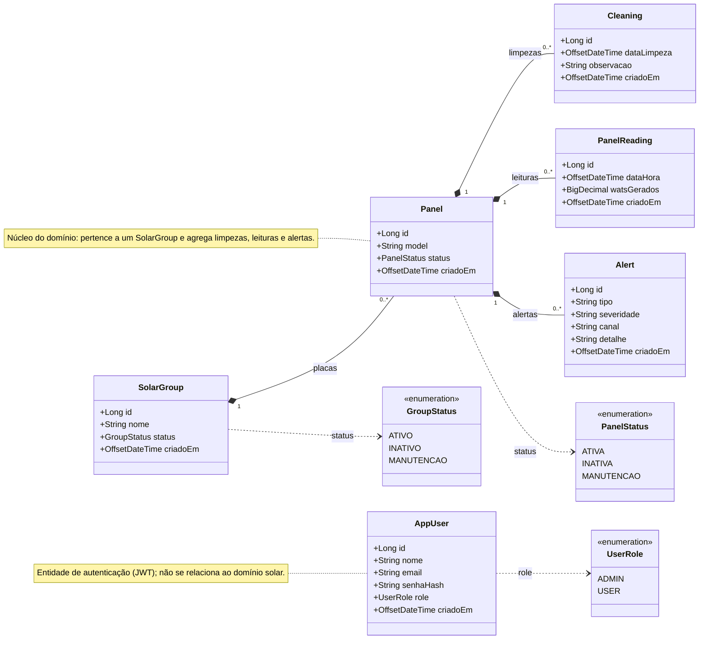

# Modelo de Classes — SolarVision

Modelo de domínio do backend: entidades JPA, enums, relacionamentos e mapeamento para o banco.

> Arquitetura geral do sistema: [ARQUITETURA.md](ARQUITETURA.md).

---

## Diagrama de classes

---

## Entidades

### AppUser — `usuarios`
Usuário do sistema (autenticação/autorização).

| Campo | Tipo Java | Coluna | Observações |
|---|---|---|---|
| id | Long | id (PK) | gerado pelo banco |
| nome | String | nome | obrigatório |
| email | String | email | único |
| senhaHash | String | senha_hash | hash BCrypt |
| role | UserRole | role | enum (texto) |
| criadoEm | OffsetDateTime | criado_em | preenchido na criação |

### SolarGroup — `grupos_solares`
Agrupamento de placas (ex.: uma usina/instalação).

| Campo | Tipo Java | Coluna | Observações |
|---|---|---|---|
| id | Long | id (PK) | |
| nome | String | nome | obrigatório |
| status | GroupStatus | status | enum |
| criadoEm | OffsetDateTime | criado_em | |
| placas | List&lt;Panel&gt; | — | relacionamento 1:N |

### Panel — `placas`
Placa/painel solar, pertencente a um grupo.

| Campo | Tipo Java | Coluna | Observações |
|---|---|---|---|
| id | Long | id (PK) | |
| grupo | SolarGroup | grupo_id (FK) | obrigatório |
| model | String | modelo | obrigatório |
| status | PanelStatus | status | enum |
| criadoEm | OffsetDateTime | criado_em | |
| limpezas | List&lt;Cleaning&gt; | — | relacionamento 1:N |
| leituras | List&lt;PanelReading&gt; | — | relacionamento 1:N |
| alertas | List&lt;Alert&gt; | — | relacionamento 1:N |

### Cleaning — `limpezas`
Registro de limpeza de uma placa.

| Campo | Tipo Java | Coluna | Observações |
|---|---|---|---|
| id | Long | id (PK) | |
| placa | Panel | placa_id (FK) | obrigatório |
| dataLimpeza | OffsetDateTime | data_limpeza | obrigatório |
| observacao | String | observacao | opcional (texto) |
| criadoEm | OffsetDateTime | criado_em | |

### PanelReading — `leituras_energia`
Leitura de geração de energia de uma placa (série temporal; carregada via seeder do CSV).

| Campo | Tipo Java | Coluna | Observações |
|---|---|---|---|
| id | Long | id (PK) | |
| placa | Panel | placa_id (FK) | obrigatório |
| dataHora | OffsetDateTime | data_hora | obrigatório |
| watsGerados | BigDecimal | wats_gerados | numeric(14,4) |
| criadoEm | OffsetDateTime | criado_em | |

### Alert — `alertas`
Alerta associado a uma placa (gerado pelos serviços gRPC).

| Campo | Tipo Java | Coluna | Observações |
|---|---|---|---|
| id | Long | id (PK) | |
| placa | Panel | placa_id (FK) | obrigatório |
| tipo | String | tipo | ex.: SOILING, EMAIL |
| severidade | String | severidade | ex.: BAIXA, ALTA |
| canal | String | canal | GRPC / EMAIL |
| detalhe | String | detalhe | descrição (texto) |
| criadoEm | OffsetDateTime | criado_em | |

---

## Enums

| Enum | Valores | Usado em |
|---|---|---|
| UserRole | ADMIN, USER | AppUser.role |
| GroupStatus | ATIVO, INATIVO, MANUTENCAO | SolarGroup.status |
| PanelStatus | ATIVA, INATIVA, MANUTENCAO | Panel.status |

---

## Relacionamentos

| Origem | Cardinalidade | Destino | Mapeamento JPA |
|---|---|---|---|
| SolarGroup | 1 : N | Panel | `@OneToMany(mappedBy="grupo")` / `@ManyToOne` em Panel |
| Panel | 1 : N | Cleaning | `@OneToMany(mappedBy="placa")` / `@ManyToOne` em Cleaning |
| Panel | 1 : N | PanelReading | `@OneToMany(mappedBy="placa")` / `@ManyToOne` em PanelReading |
| Panel | 1 : N | Alert | `@OneToMany(mappedBy="placa")` / `@ManyToOne` em Alert |

A exclusão é em cascata: remover um grupo remove suas placas e, por consequência, limpezas, leituras e alertas (cascade no JPA + `ON DELETE CASCADE` no banco).

---

## Mapeamento entidade → repository

Cada entidade é acessada por um repositório Spring Data JPA (`JpaRepository`):

| Entidade | Repository | Consultas notáveis |
|---|---|---|
| AppUser | AppUserRepository | `findByEmailIgnoreCase`, `existsByEmailIgnoreCase` |
| SolarGroup | SolarGroupRepository | `findAllByOrderByIdAsc` |
| Panel | PanelRepository | `findByGrupoIdOrderByIdAsc`, `countByStatus`, `countByGrupoId` |
| Cleaning | CleaningRepository | `buscar(...)` (@Query JPQL com filtros), `findFirstByOrderByDataLimpezaDescIdDesc` |
| PanelReading | PanelReadingRepository | `agruparMetricas(...)` (@Query nativa), `somarPorPeriodo` |
| Alert | AlertRepository | CRUD padrão |

---

## Notas de mapeamento JPA

- Chaves primárias: `@Id @GeneratedValue(strategy = IDENTITY)` (sequência do PostgreSQL).
- Enums persistidos como texto: `@Enumerated(EnumType.STRING)`.
- `criadoEm` preenchido automaticamente na inserção: `@CreationTimestamp` (coluna não atualizável).
- Relacionamentos `@ManyToOne` carregados conforme necessidade; coleções `@OneToMany` são lazy.
- O schema é criado pelo Flyway; o Hibernate roda em `ddl-auto: validate` (somente valida o mapeamento).
