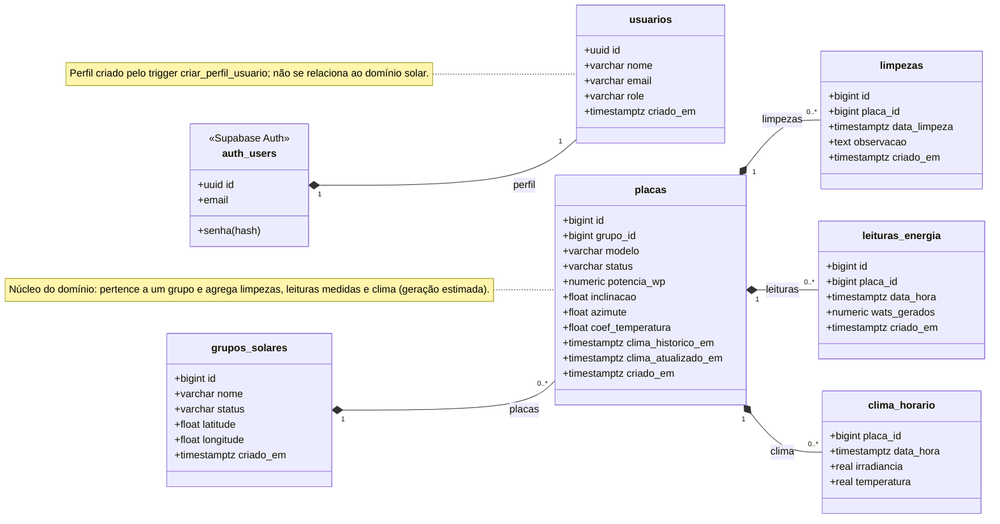

# Modelo de Classes - SolarVision

Modelo de domínio do SolarVision. Desde a migração para o Supabase, o domínio é representado diretamente pelas **tabelas do PostgreSQL** (`supabase/migrations/`; o clima vem de `20261007120000_clima_open_meteo.sql`); não há mais classes de entidade no backend. O diagrama abaixo mostra cada tabela como uma classe.

> Arquitetura geral do sistema: [ARQUITETURA.md](ARQUITETURA.md).

---

## Diagrama de classes

---

## Tabelas

### `usuarios`
Perfil do usuário. A senha e o login ficam no Supabase Auth (`auth.users`); a linha é criada pelo trigger `criar_perfil_usuario` no cadastro.

| Coluna | Tipo | Observações |
|---|---|---|
| id | uuid (PK) | FK para `auth.users(id)`, `on delete cascade` |
| nome | varchar(100) | obrigatório; vem de `options.data.nome` no cadastro (ou da parte local do e-mail) |
| email | varchar(255) | único |
| role | varchar(30) | `ADMIN` ou `USER`, padrão `USER` |
| criado_em | timestamptz | padrão `now()` |

### `grupos_solares`
Agrupamento de placas (ex.: uma usina/instalação).

| Coluna | Tipo | Observações |
|---|---|---|
| id | bigint (PK) | identity |
| nome | varchar(120) | obrigatório, não pode ser só espaços |
| status | varchar(30) | `ATIVO`, `INATIVO` ou `MANUTENCAO`, padrão `ATIVO` |
| latitude | double precision | opcional, -90 a 90; local usado para buscar o clima |
| longitude | double precision | opcional, -180 a 180 |
| criado_em | timestamptz | padrão `now()` |

### `placas`
Placa/painel solar, pertencente a um grupo. As especificações são opcionais; sem elas (ou sem local no grupo) a placa não tem estimativa.

| Coluna | Tipo | Observações |
|---|---|---|
| id | bigint (PK) | identity |
| grupo_id | bigint (FK) | `grupos_solares(id)`, obrigatório |
| modelo | varchar(120) | obrigatório, não pode ser só espaços |
| status | varchar(30) | `ATIVA`, `INATIVA` ou `MANUTENCAO`, padrão `ATIVA` |
| potencia_wp | numeric(10,2) | potência nominal (Wp), > 0 |
| inclinacao | double precision | graus, 0 a 90 |
| azimute | double precision | graus, 0 a <360: 0 = Norte, 90 = Leste, 180 = Sul, 270 = Oeste (convertido para a convenção do Open-Meteo na busca) |
| coef_temperatura | double precision | %/°C, padrão `-0.40` |
| clima_historico_em | timestamptz | quando os 5 anos de clima foram carregados (null = pendente) |
| clima_atualizado_em | timestamptz | última busca no Open-Meteo |
| criado_em | timestamptz | padrão `now()` |

### `limpezas`
Registro de limpeza de uma placa.

| Coluna | Tipo | Observações |
|---|---|---|
| id | bigint (PK) | identity |
| placa_id | bigint (FK) | `placas(id)`, obrigatório |
| data_limpeza | timestamptz | obrigatório |
| observacao | text | opcional, até 1000 caracteres |
| criado_em | timestamptz | padrão `now()` |

### `leituras_energia`
Leitura **medida** de geração de uma placa (série temporal de sensores). Vazia até haver sensor ou API de inversor integrados; os dados mocados do CSV foram removidos.

| Coluna | Tipo | Observações |
|---|---|---|
| id | bigint (PK) | identity |
| placa_id | bigint (FK) | `placas(id)`, obrigatório |
| data_hora | timestamptz | obrigatório |
| wats_gerados | numeric(14,4) | obrigatório; potência média de 5 min |
| criado_em | timestamptz | padrão `now()` |

### `clima_horario`
Clima de cada hora no local e no plano de uma placa (Open-Meteo), base da geração **estimada**. Gravada só pelo pg_cron (`sincronizar_clima`); ~3,5 MB por placa a cada 5 anos.

| Coluna | Tipo | Observações |
|---|---|---|
| placa_id | bigint (PK, FK) | `placas(id)`, `on delete cascade` |
| data_hora | timestamptz (PK) | início da hora (UTC) |
| irradiancia | real | W/m² no plano da placa (GTI), média da hora |
| temperatura | real | °C do ar a 2 m |

> A tabela `alertas` da versão Spring Boot foi removida: só era usada pelos serviços gRPC.

---

## Domínios de valores (status e papel)

Os antigos enums Java viraram constraints `CHECK` no banco:

| Coluna | Valores |
|---|---|
| `usuarios.role` | ADMIN, USER |
| `grupos_solares.status` | ATIVO, INATIVO, MANUTENCAO |
| `placas.status` | ATIVA, INATIVA, MANUTENCAO |

---

## Relacionamentos

| Origem | Cardinalidade | Destino | Chave estrangeira |
|---|---|---|---|
| auth.users | 1 : 1 | usuarios | `usuarios.id` |
| grupos_solares | 1 : N | placas | `placas.grupo_id` |
| placas | 1 : N | limpezas | `limpezas.placa_id` |
| placas | 1 : N | leituras_energia | `leituras_energia.placa_id` |
| placas | 1 : N | clima_horario | `clima_horario.placa_id` |

A exclusão é em cascata (`on delete cascade`): remover um grupo remove suas placas e, por consequência, limpezas, leituras e clima.

---

## Índices, funções e políticas

- **Índices**: `placas.grupo_id`, `limpezas.placa_id`, `limpezas.data_limpeza desc`, `leituras_energia.placa_id`, `leituras_energia.data_hora`; `clima_horario` usa a PK `(placa_id, data_hora)`.
- **Funções (RPC)**: `dashboard_metricas(granularidade, data_inicio, data_fim, grupo, placa)` e `dashboard_resumo()` - ver [FUNCIONALIDADES.md](FUNCIONALIDADES.md).
- **Funções do clima**: `potencia_estimada(potencia_wp, coef_temperatura, irradiancia, temperatura)` (W estimados de uma hora) e, só para o pg_cron, `sincronizar_clima()` e `atualizar_clima_placa(placa_id, historico)` - ver [ARQUITETURA.md](ARQUITETURA.md#5-geração-estimada-pelo-clima-open-meteo).
- **RLS**: habilitada em todas as tabelas - ver [ARQUITETURA.md](ARQUITETURA.md#4-segurança).
- **Nomes no JSON**: `frontend/src/lib/api.js` usa aliases (`criadoEm:criado_em`, `grupoId:grupo_id`...) para entregar às telas os mesmos campos camelCase da API antiga.
