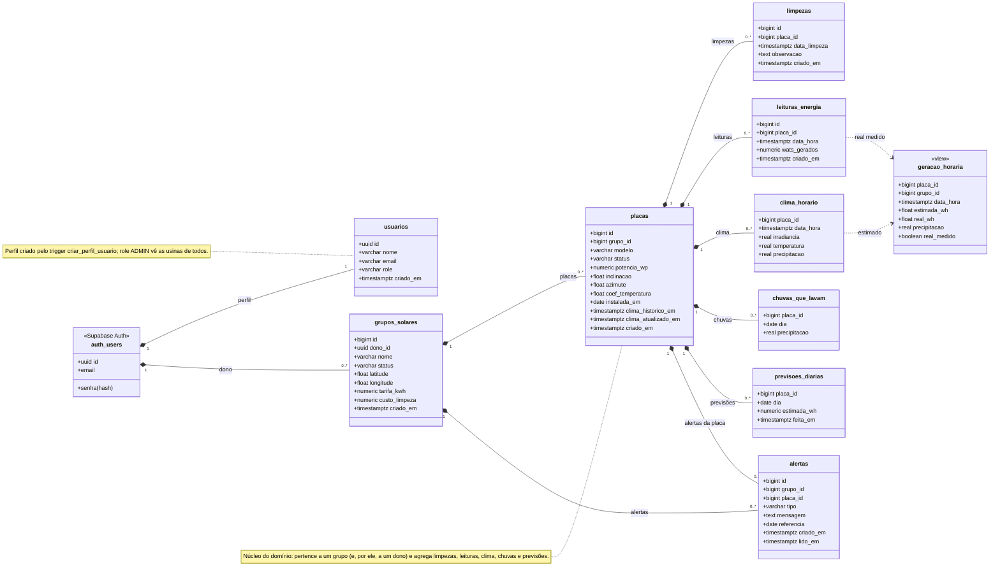

# Modelo de Classes - SolarVision

Modelo de domínio do SolarVision. Desde a migração para o Supabase, o domínio é representado diretamente pelas **tabelas do PostgreSQL** (`supabase/migrations/`; o clima vem de `20261007120000_clima_open_meteo.sql`, o dono dos grupos e a view `geracao_horaria` de `20261008090000_dono_e_geracao_horaria.sql` e as análises das migrations `20261008110000` a `20261008130000`); não há mais classes de entidade no backend. O diagrama abaixo mostra cada tabela como uma classe.

> Arquitetura geral do sistema: [ARQUITETURA.md](ARQUITETURA.md).

---

## Diagrama de classes

---

## Tabelas

### `usuarios`
Perfil do usuário. A senha e o login ficam no Supabase Auth (`auth.users`); a linha é criada pelo trigger `criar_perfil_usuario` no cadastro.

| Coluna | Tipo | Observações |
|---|---|---|
| id | uuid (PK) | FK para `auth.users(id)`, `on delete cascade` |
| nome | varchar(100) | obrigatório; vem de `options.data.nome` no cadastro (ou da parte local do e-mail) |
| email | varchar(255) | único |
| role | varchar(30) | `ADMIN` ou `USER`, padrão `USER`. `ADMIN` vê e altera os grupos de todos os usuários; a promoção é só por SQL (`update usuarios set role = 'ADMIN' where email = '...'`) |
| criado_em | timestamptz | padrão `now()` |
| alerta_limpeza, alerta_previsao, alerta_desempenho | boolean | padrão true; tipos de alerta que o `gerar_alertas` grava para os grupos do usuário |
| limiar_limpeza | numeric(3,2) | padrão 0,10 (entre 0,01 e 0,20): perda a partir da qual `recomendacoes_limpeza` recomenda limpar |
| limiar_previsao | numeric(3,2) | padrão 0,60 (entre 0,10 e 0,95): previsão baixa abaixo desta fração da média de 5 anos |
| tarifa_padrao, custo_limpeza_padrao | numeric | opcionais; pré-preenchem tarifa e custo de limpeza do "Novo grupo" |

O usuário altera só `nome` e as preferências da própria linha (grant por coluna); `role` e `email`, nunca.

### `grupos_solares`
Agrupamento de placas (ex.: uma usina/instalação). Cada grupo tem um dono; placas, limpezas, leituras, clima, chuvas e previsões herdam o acesso pelo grupo.

| Coluna | Tipo | Observações |
|---|---|---|
| id | bigint (PK) | identity |
| dono_id | uuid (FK) | `auth.users(id)`, obrigatório, padrão `auth.uid()` (quem cria), `on delete cascade`. Os grupos que já existiam antes da coluna ficaram com o primeiro usuário cadastrado |
| nome | varchar(120) | obrigatório, não pode ser só espaços |
| status | varchar(30) | `ATIVO`, `INATIVO` ou `MANUTENCAO`, padrão `ATIVO` |
| latitude | double precision | opcional, -90 a 90; local usado para buscar o clima |
| longitude | double precision | opcional, -180 a 180 |
| tarifa_kwh | numeric(8,4) | opcional, > 0; R$/kWh da conta de luz, valora a energia (economia e perda em R$) |
| custo_limpeza | numeric(10,2) | opcional, ≥ 0; R$ para limpar uma placa, usado na recomendação de limpeza |
| criado_em | timestamptz | padrão `now()` |

### `placas`
Placa/painel solar, pertencente a um grupo. As especificações são opcionais; sem elas (ou sem local no grupo) a placa não tem estimativa.

| Coluna | Tipo | Observações |
|---|---|---|
| id | bigint (PK) | identity |
| grupo_id | bigint (FK) | `grupos_solares(id)`, obrigatório |
| modelo | varchar(120) | obrigatório, não pode ser só espaços |
| status | varchar(30) | `ATIVA`, `INATIVA` ou `MANUTENCAO`, padrão `ATIVA` |
| potencia_wp | numeric(10,2) | potência nominal (Wp), > 0 |
| inclinacao | double precision | graus, 0 a 90 |
| azimute | double precision | graus, 0 a <360: 0 = Norte, 90 = Leste, 180 = Sul, 270 = Oeste (convertido para a convenção do Open-Meteo na busca) |
| coef_temperatura | double precision | %/°C, padrão `-0.40` |
| instalada_em | date | opcional; sem limpeza nem chuva que lave depois dela, a sujeira conta a partir desta data |
| clima_historico_em | timestamptz | quando os 5 anos de clima foram carregados (null = pendente; zerado pelos triggers de recarga) |
| clima_atualizado_em | timestamptz | última busca no Open-Meteo |
| criado_em | timestamptz | padrão `now()` |

### `limpezas`
Registro de limpeza de uma placa.

| Coluna | Tipo | Observações |
|---|---|---|
| id | bigint (PK) | identity |
| placa_id | bigint (FK) | `placas(id)`, obrigatório |
| data_limpeza | timestamptz | obrigatório |
| observacao | text | opcional, até 1000 caracteres |
| criado_em | timestamptz | padrão `now()` |

### `leituras_energia`
Leitura **medida** de geração de uma placa. Preenchida pela importação de CSV no Monitoramento (`ImportarLeituras`), gravada pelo dono do grupo; nas horas com leituras, o real do dashboard é o medido. Sensor (ESP32) ou API de inversor ainda não estão integrados.

| Coluna | Tipo | Observações |
|---|---|---|
| id | bigint (PK) | identity |
| placa_id | bigint (FK) | `placas(id)`, obrigatório |
| data_hora | timestamptz | obrigatório; início do intervalo da leitura. Único por placa (`unique (placa_id, data_hora)`, alvo do upsert: reimportar não duplica) |
| wats_gerados | numeric(14,4) | obrigatório; potência média (W) do intervalo que começa em `data_hora` (5 min no CSV de referência) |
| criado_em | timestamptz | padrão `now()` |

### `clima_horario`
Clima de cada hora no local e no plano de uma placa (Open-Meteo), base da geração **estimada**. Gravada só pelo pg_cron (`sincronizar_clima`); ~3,5 MB por placa a cada 5 anos.

| Coluna | Tipo | Observações |
|---|---|---|
| placa_id | bigint (PK, FK) | `placas(id)`, `on delete cascade` |
| data_hora | timestamptz (PK) | início da hora (UTC) |
| irradiancia | real | W/m² no plano da placa (GTI), média da hora |
| temperatura | real | °C do ar a 2 m |
| precipitacao | real | mm de chuva na hora (null nas linhas carregadas antes da coluna; o deploy recarregou o histórico de todas as placas) |

### `chuvas_que_lavam`
Dias em que choveu o bastante para lavar a placa (≥ 5 mm no dia, fuso de São Paulo). Recalculada por `atualizar_clima_placa` a partir do clima recebido (inclui os dias da previsão); só leitura para o cliente.

| Coluna | Tipo | Observações |
|---|---|---|
| placa_id | bigint (PK, FK) | `placas(id)`, `on delete cascade` |
| dia | date (PK) | dia no fuso de São Paulo; a placa fica limpa no fim do dia |
| precipitacao | real | mm no dia |

### `previsoes_diarias`
Energia estimada de amanhã, guardada às 21:00 (São Paulo) pelo job `guardar-previsao`, para comparar depois com o clima que aconteceu (o `clima_horario` é sobrescrito de hora em hora). Começa vazia após o deploy.

| Coluna | Tipo | Observações |
|---|---|---|
| placa_id | bigint (PK, FK) | `placas(id)`, `on delete cascade` |
| dia | date (PK) | dia previsto, no fuso de São Paulo |
| estimada_wh | numeric | energia estimada do dia (Wh) |
| feita_em | timestamptz | quando a previsão foi guardada |

### `alertas`
Gravados pelo job `gerar-alertas` (07:00 de São Paulo, função `gerar_alertas()`); o dono só lê e marca como lido. Ver [FUNCIONALIDADES.md](FUNCIONALIDADES.md#alertas).

| Coluna | Tipo | Observações |
|---|---|---|
| id | bigint (PK) | identity |
| grupo_id | bigint (FK, NOT NULL) | `grupos_solares(id)`, `on delete cascade`; a RLS vem por ele |
| placa_id | bigint (FK) | `placas(id)`, `on delete cascade`; null = alerta do grupo (previsão baixa) |
| tipo | varchar(30) | LIMPEZA, PREVISAO_BAIXA, DESEMPENHO (`CHECK`) |
| mensagem | text | texto pronto para a tela |
| referencia | date | dia previsto (previsão baixa) ou segunda-feira da semana (limpeza, desempenho); unique `nulls not distinct (grupo_id, placa_id, tipo, referencia)` evita repetição |
| criado_em | timestamptz | `default now()` |
| lido_em | timestamptz | null = não lido; única coluna que o dono pode alterar (grant de coluna) |

### View `geracao_horaria`
Fonte única da geração por hora e por placa, usada por todas as funções do dashboard. `security_invoker`: respeita a RLS de quem consulta. Só placas com `potencia_wp`.

| Coluna | Observações |
|---|---|
| placa_id, grupo_id, data_hora | uma linha por hora de `clima_horario` |
| estimada_wh | `potencia_estimada(...)` da hora (W médio da hora = Wh) |
| real_wh | só até a última hora completa: a energia das leituras da hora, se houver; senão o estimado × (1 − `perda_sujeira_em`) |
| precipitacao | mm na hora |
| real_medido | true quando o real da hora veio de leituras |

Energia de uma hora com leituras: Σ W × intervalo, com o intervalo inferido pelo espaçamento das leituras dentro da hora e limitado a 60 min ÷ nº de leituras (leituras de 1, 5 ou 15 min dão a mesma energia; uma leitura isolada vale pela hora).

---

## Domínios de valores (status e papel)

Os antigos enums Java viraram constraints `CHECK` no banco:

| Coluna | Valores |
|---|---|
| `usuarios.role` | ADMIN, USER |
| `grupos_solares.status` | ATIVO, INATIVO, MANUTENCAO |
| `placas.status` | ATIVA, INATIVA, MANUTENCAO |
| `alertas.tipo` | LIMPEZA, PREVISAO_BAIXA, DESEMPENHO |

---

## Relacionamentos

| Origem | Cardinalidade | Destino | Chave estrangeira |
|---|---|---|---|
| auth.users | 1 : 1 | usuarios | `usuarios.id` |
| auth.users | 1 : N | grupos_solares | `grupos_solares.dono_id` |
| grupos_solares | 1 : N | placas | `placas.grupo_id` |
| placas | 1 : N | limpezas | `limpezas.placa_id` |
| placas | 1 : N | leituras_energia | `leituras_energia.placa_id` |
| placas | 1 : N | clima_horario | `clima_horario.placa_id` |
| placas | 1 : N | chuvas_que_lavam | `chuvas_que_lavam.placa_id` |
| placas | 1 : N | previsoes_diarias | `previsoes_diarias.placa_id` |
| grupos_solares | 1 : N | alertas | `alertas.grupo_id` |
| placas | 1 : N | alertas | `alertas.placa_id` (opcional) |

A exclusão é em cascata (`on delete cascade`): remover um usuário do Auth remove seus grupos; remover um grupo remove suas placas e, por consequência, limpezas, leituras, clima, chuvas, previsões e alertas.

---

## Índices, funções e políticas

- **Índices**: `grupos_solares.dono_id`, `placas.grupo_id`, `limpezas.placa_id`, `limpezas.data_limpeza desc`; `leituras_energia` usa o unique `(placa_id, data_hora)` (os índices de uma coluna saíram); `clima_horario`, `chuvas_que_lavam` e `previsoes_diarias` usam a PK `(placa_id, data_hora|dia)`.
- **Funções do dashboard (RPC)**: `dashboard_metricas(granularidade, data_inicio, data_fim, grupo, placa)`, `dashboard_resumo()`, `dashboard_financeiro(data_inicio, data_fim, grupo, placa)`, `dashboard_historico(granularidade, data_inicio, data_fim, grupo, placa)`, `ranking_placas(data_inicio, data_fim, grupo)`, `recomendacoes_limpeza()` e `acerto_previsao(dias, grupo, placa)` - ver [FUNCIONALIDADES.md](FUNCIONALIDADES.md).
- **Sujeira**: `perda_sujeira_em(placa_id, instante)` (0 a 0,20; security definer com a regra do dono repetida, ver [ARQUITETURA.md](ARQUITETURA.md#4-segurança)) e a coluna calculada `perda_sujeira(placas)` (perda agora, lida pela API como `placas?select=...,perda_sujeira`).
- **Funções do clima**: `potencia_estimada(potencia_wp, coef_temperatura, irradiancia, temperatura)` (W estimados de uma hora) e, só para o pg_cron, `sincronizar_clima()`, `atualizar_clima_placa(placa_id, historico)` e `guardar_previsao()` - ver [ARQUITETURA.md](ARQUITETURA.md#5-geração-estimada-pelo-clima-open-meteo).
- **Triggers**: `criar_perfil_usuario` (perfil no cadastro), `ao_mudar_orientacao_placa` (inclinação, azimute ou grupo) e `ao_mudar_local_grupo` (latitude/longitude) zeram `clima_historico_em`/`clima_atualizado_em` para o pg_cron recarregar o clima.
- **Acesso**: `e_admin()` (o usuário logado tem `role = 'ADMIN'`), usada pela política dos grupos.
- **RLS**: habilitada em todas as tabelas; grupos pelo dono (ou ADMIN), o resto pelo grupo - ver [ARQUITETURA.md](ARQUITETURA.md#4-segurança).
- **Nomes no JSON**: `frontend/src/lib/api.js` usa aliases (`criadoEm:criado_em`, `grupoId:grupo_id`, `tarifaKwh:tarifa_kwh`...) para entregar às telas os campos em camelCase.
