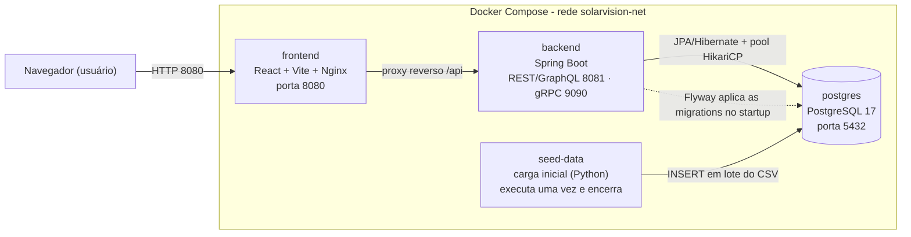

# SolarVision

Sistema full-stack para monitoramento de energia solar com microsserviços em Docker, backend em Spring Boot, banco PostgreSQL, carga inicial por CSV em Python e frontend SPA em React + Vite.

## Estrutura

```text
SolarVision/
├── backend/          # API Spring Boot + JWT + GraphQL + schema + seeder
├── frontend/         # SPA React + Vite + ApexCharts
└── docker-compose.yml
```

## Arquitetura (visão geral)



Detalhes de arquitetura (camadas, fluxos, stack e decisões) em [`docs/ARQUITETURA.md`](docs/ARQUITETURA.md) e o modelo de domínio em [`docs/MODELO-DE-CLASSES.md`](docs/MODELO-DE-CLASSES.md).

## Stack

- Backend: Java 25, Spring Boot 3.5.12, Spring Security (JWT), Spring Data JPA, Flyway, GraphQL, gRPC (Spring gRPC), springdoc-openapi (Swagger)
- Frontend: React, Vite, React Router, Axios, ApexCharts, Bootstrap
- Banco: PostgreSQL 17
- Seeder: Python 3.12 + psycopg2
- Infra: Docker Compose + Nginx

## Serviços

- `postgres`: banco principal
- `backend`: API em `http://localhost:8081`
- `frontend`: SPA em `http://localhost:8080`
- `seed-data`: carga efêmera do CSV na tabela `leituras_energia`

## Execução

```bash
docker compose up --build -d
```

## Parar

```bash
docker compose down
```

Para remover também o volume do PostgreSQL:

```bash
docker compose down -v
```

## Fluxo principal da aplicação

1. O PostgreSQL sobe vazio; o backend aplica as **migrations Flyway** (`backend/src/main/resources/db/migration`) criando o schema.
2. O backend conecta no banco e expõe REST + GraphQL em `/api/graphql`, Swagger em `/swagger-ui.html` e um servidor gRPC embarcado na porta `9090`.
3. O container `seed-data` usa `backend/data-seeder/`, aguarda o schema, importa o CSV e encerra automaticamente.
4. O frontend React consome a API via Nginx reverse proxy em `/api`.

## Qualidade e testes

Foi definida e aplicada uma estratégia baseada em riscos, com cenários positivos, negativos e de valores limite. Foram adicionados **42 testes automatizados** (21 no backend e 21 no frontend), preservando os 17 existentes: **59 testes executados e aprovados, sem falhas**. Os **6 roteiros funcionais integrados** também foram executados e aprovados com Java 25, PostgreSQL, navegador e ponte REST–gRPC. O build do frontend também foi concluído.

- Backend: JUnit/Mockito para limpezas e dashboard; MockMvc para validação e contrato HTTP de limpezas.
- Frontend: testes nativos do Node para escala de potência, formatação pt-BR e nomes com acentos.
- Automação: workflow de qualidade em push/PR, com backend Java 25 e frontend Node 24; ainda não executado no GitHub.
- Evidências e roteiro funcional: [estratégia e casos de teste](docs/QUALIDADE-E-TESTES.md) e [resultados](docs/evidencias/resultado.json).
- Relatório no formato do exemplo fornecido: [PDF de qualidade e testes](SolarVision_Qualidade_e_Testes.pdf).

Para reproduzir: em `frontend`, executar `npm ci`, `npm test` e `npm run build`; em `backend`, com Maven instalado e Java 25, executar `mvn -B verify`.

**Ambiente de validação:** o backend foi testado no Java 25 em Docker. O Maven Wrapper está incompleto, por isso a suíte foi executada com Maven no container. Permanecem como evoluções testes de carga, auditoria completa de acessibilidade e envio real de e-mail.

## Documentação técnica

- Arquitetura (infra, camadas, fluxos): [`docs/ARQUITETURA.md`](docs/ARQUITETURA.md)
- Modelo de classes (domínio): [`docs/MODELO-DE-CLASSES.md`](docs/MODELO-DE-CLASSES.md)
- Funcionalidades e endpoints: [`docs/FUNCIONALIDADES.md`](docs/FUNCIONALIDADES.md)
- Decisões técnicas: [`docs/DECISOES-TECNICAS.md`](docs/DECISOES-TECNICAS.md)
- Guia do código (backend + APIs): [`docs/GUIA-DO-CODIGO.md`](docs/GUIA-DO-CODIGO.md)
- Features incompletas (pendências): [`docs/FEATURES-INCOMPLETAS.md`](docs/FEATURES-INCOMPLETAS.md)
