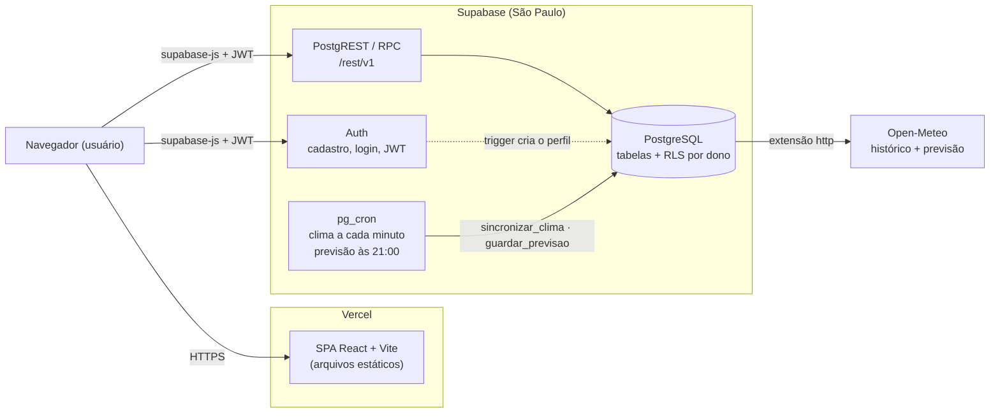

# SolarVision

Sistema web para monitoramento de energia solar: SPA em React + Vite hospedada na **Vercel** e **Supabase** como backend completo (Auth, API REST gerada pelo PostgREST, funções SQL/RPC, PostgreSQL e pg_cron). A geração é **estimada a partir do clima real** ([Open-Meteo](https://open-meteo.com/)): ao cadastrar uma placa com local e especificações, o próprio banco carrega 5 anos de clima horário e a previsão dos próximos 7 dias. A geração **real** vem das leituras importadas por CSV nas horas que as têm e, nas demais, é simulada (o estimado menos a perda por sujeira desde a última limpeza, chuva que lavou a placa ou instalação). Sobre isso o app mostra economia em R$, CO₂ evitado, recomendação de limpeza, a média de 5 anos do clima, o acerto da previsão e o ranking das placas. Cada usuário só vê as próprias usinas.

> Até a migração, o backend era uma API Spring Boot (Java 25, JWT, GraphQL, gRPC, Flyway, Swagger) orquestrada com Docker Compose. Esse código foi removido; o histórico está no Git e em [`docs/QUALIDADE-E-TESTES.md`](docs/QUALIDADE-E-TESTES.md).

## Estrutura

```text
SolarVision/
├── frontend/              # SPA React + Vite + ApexCharts (deploy na Vercel)
├── supabase/
│   ├── migrations/        # schema, RLS, triggers, view e funções RPC, clima (Open-Meteo) e jobs pg_cron
│   ├── seed/              # CSV de leituras do Fotovoltaica-UFSC (não é carregado; usado na validação do modelo)
│   └── tests/             # teste de ponta a ponta (e2e.mjs)
└── docs/                  # documentação técnica
    └── validacao/         # validação do modelo de geração contra leituras reais
```

## Arquitetura (visão geral)



A Vercel só entrega os arquivos estáticos; depois de carregada, a SPA fala direto com o Supabase pelo `@supabase/supabase-js`. Detalhes em [`docs/ARQUITETURA.md`](docs/ARQUITETURA.md) e o modelo de dados em [`docs/MODELO-DE-CLASSES.md`](docs/MODELO-DE-CLASSES.md).

## Stack

- Frontend: React 19, Vite 7, React Router, `@supabase/supabase-js`, ApexCharts, Bootstrap
- Backend: Supabase (Auth, PostgREST, funções PL/pgSQL via RPC, pg_graphql, pg_cron, extensão `http`)
- Banco: PostgreSQL gerenciado pelo Supabase (região São Paulo)
- Clima: Open-Meteo (gratuito para uso não comercial, sem chave; dados CC BY 4.0, atribuição no rodapé do app)
- Hospedagem: Vercel (projeto `solarvision`, Root Directory `frontend`)
- CI: GitHub Actions (testes + build do frontend; migrations + teste de ponta a ponta ao publicar em `qa`/`production`; requisição diária para o Supabase free não pausar)

## Execução local

O frontend roda localmente apontando para o projeto Supabase.

```bash
cd frontend
cp .env.example .env.local   # preencher VITE_SUPABASE_PUBLISHABLE_KEY
npm install
npm run dev                   # http://localhost:5173
```

Variáveis (em Supabase > Project Settings > API Keys):

| Variável | Valor |
|---|---|
| `VITE_SUPABASE_URL` | `https://skfguameoeklepcjnqth.supabase.co` |
| `VITE_SUPABASE_PUBLISHABLE_KEY` | chave publicável (pública; a proteção dos dados é feita pela RLS) |

## Banco: migrations e clima

1. **Schema:** as migrations de `supabase/migrations/` são aplicadas automaticamente pelo workflow `.github/workflows/supabase.yml` a cada push em `qa`/`production` (`supabase db push`, segredo `SUPABASE_DB_URL` do repositório). Para aplicar à mão: `npx supabase db push --db-url "<connection string do Session pooler>"`. Elas criam as tabelas, as políticas RLS (cada usuário só vê os grupos de que é dono; ADMIN vê todos), os triggers, a view `geracao_horaria`, as funções do dashboard, das análises e do clima e os jobs pg_cron (`sincronizar-clima`, `guardar-previsao` e `gerar-alertas`).
2. **Dados:** não há carga manual. Ao cadastrar um grupo com latitude/longitude e uma placa com potência (Wp), inclinação e orientação, o job `sincronizar-clima` (pg_cron, a cada minuto) baixa do Open-Meteo, em ~1 min, 5 anos de clima horário e a previsão; depois a previsão é atualizada de hora em hora. Mudar o local do grupo ou a inclinação/orientação da placa recarrega o clima. Leituras reais entram pelo Monitoramento (placa selecionada > **Importar leituras (CSV)**). Detalhes em [`docs/ARQUITETURA.md`](docs/ARQUITETURA.md#5-geração-estimada-pelo-clima-open-meteo).
3. **Administrador:** não há tela; para um usuário ver as usinas de todos, no SQL Editor: `update public.usuarios set role = 'ADMIN' where email = '...';`. Os grupos criados antes do dono por grupo ficaram com o primeiro usuário cadastrado.

Os dados mocados do CSV (grupo "Grupo Seeder SolarVision", o job que os deslocava para hoje e o `inserirCSV.py`) foram removidos. `supabase/seed/Dados_Tratados_CDTE-PSI.csv` não é carregado no banco: serve de referência e de base para a [validação do modelo](docs/validacao/RESULTADO.md).

## Deploy e branches

A Vercel publica o diretório `frontend` (`frontend/vercel.json` faz o rewrite de SPA para `index.html`).

| Branch | Ambiente Vercel | URL |
|---|---|---|
| `production` | Production | https://solarvision-senai.vercel.app |
| `qa` | QA (domínio fixo) | https://solarvision-senai-qa.vercel.app |
| demais branches/PRs | Preview | URL gerada por deploy |

Fluxo de entrega:

1. Desenvolver em uma branch de feature e abrir PR para `main` (o CI roda testes e build).
2. Fazer merge de `main` em `qa` e validar na URL de QA.
3. Fazer merge de `qa` em `production`.

Os dois ambientes usam **o mesmo projeto Supabase** (`skfguameoeklepcjnqth`): QA e produção compartilham banco e usuários. Ver [`docs/DECISOES-TECNICAS.md`](docs/DECISOES-TECNICAS.md).

## Qualidade e testes

- **Frontend:** 54 testes nativos do Node (`node --test`) para escala de potência/energia, formatação pt-BR (inclusive R$ e CO₂), nomes com acentos, janelas do gráfico no fuso de São Paulo, leitura de coordenadas do Google Maps, sujeira, comparação com a média histórica, erro da previsão, calendário, leitura do CSV de leituras, janelas do relatório (mês x mês anterior) e datas dos alertas.
- **Ponta a ponta:** `supabase/tests/e2e.mjs` (10 testes) roda o `api.js` do frontend contra o Supabase (RLS, inclusive um segundo usuário que não vê nem altera o grupo do primeiro, perfil, cadastros, edição/exclusão, recarga do clima ao editar, carga dos 5 anos de clima pelo pg_cron, estimativa/previsão do dashboard, valores do período, recomendação de limpeza, leituras importadas, ranking, média de 5 anos, acerto da previsão, alertas, preferências do usuário e mensagens de erro), com contas fixas de teste, e apaga o que cria. Espera o pg_cron carregar o clima (~30 s observados, limite de 3 min). Na rodada de análises os testes passaram contra um Supabase local recriado do zero com todas as migrations.
- **Validação do modelo:** [`docs/validacao/`](docs/validacao/RESULTADO.md) compara a geração estimada com 5 anos de leituras reais (Fotovoltaica-UFSC): r diário ≈ 0,89 e erro mensal ≈ 6 %, com PR real provavelmente abaixo do 0,82 fixo.
- **CI:** `.github/workflows/quality.yml` roda em push/PR com Node 24 (`npm ci`, testes com relatório JUnit e `npm run build`). `.github/workflows/supabase.yml` aplica as migrations e roda o teste de ponta a ponta a cada push em `qa`/`production`, e faz uma requisição diária ao Supabase, porque o plano free pausa projetos parados por 7 dias. O GitHub desliga workflows agendados após 60 dias sem commits no repositório.

Para reproduzir, em `frontend`: `npm ci`, `npm test` e `npm run build`. Ponta a ponta, na raiz: `node --env-file=frontend/.env.local --test supabase/tests/e2e.mjs`.

**Histórico (versão Spring Boot/Docker):** a estratégia de qualidade, os 38 testes do backend (21 deles adicionados nessa etapa), os 6 roteiros funcionais integrados (`docs/testes-integrados.cjs`) e as evidências foram produzidos antes da migração e ficam como registro em [estratégia e casos de teste](docs/QUALIDADE-E-TESTES.md), [resultados](docs/evidencias/resultado.json) e no [PDF de qualidade e testes](SolarVision_Qualidade_e_Testes.pdf). Os testes Java saíram junto com o backend.

## Documentação técnica

- Índice: [`docs/README.md`](docs/README.md)
- Arquitetura (implantação, segurança, fluxos): [`docs/ARQUITETURA.md`](docs/ARQUITETURA.md)
- Modelo de dados: [`docs/MODELO-DE-CLASSES.md`](docs/MODELO-DE-CLASSES.md)
- Funcionalidades e tabelas/RPC por tela: [`docs/FUNCIONALIDADES.md`](docs/FUNCIONALIDADES.md)
- Decisões técnicas: [`docs/DECISOES-TECNICAS.md`](docs/DECISOES-TECNICAS.md)
- Features incompletas (pendências): [`docs/FEATURES-INCOMPLETAS.md`](docs/FEATURES-INCOMPLETAS.md)
- Validação do modelo de geração: [`docs/validacao/RESULTADO.md`](docs/validacao/RESULTADO.md)
