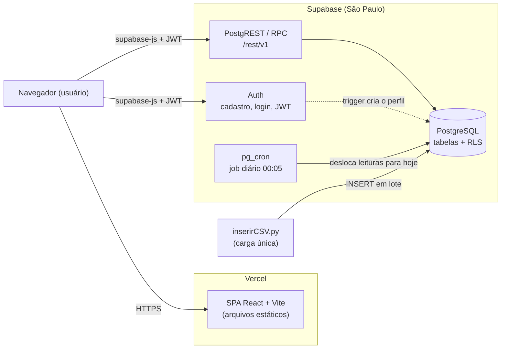

# SolarVision

Sistema web para monitoramento de energia solar: SPA em React + Vite hospedada na **Vercel** e **Supabase** como backend completo (Auth, API REST gerada pelo PostgREST, funções SQL/RPC, PostgreSQL e pg_cron). A carga inicial das leituras vem de um CSV, importado por um script Python.

> Até a migração, o backend era uma API Spring Boot (Java 25, JWT, GraphQL, gRPC, Flyway, Swagger) orquestrada com Docker Compose. Esse código foi removido; o histórico está no Git e em [`docs/QUALIDADE-E-TESTES.md`](docs/QUALIDADE-E-TESTES.md).

## Estrutura

```text
SolarVision/
├── frontend/              # SPA React + Vite + ApexCharts (deploy na Vercel)
├── supabase/
│   ├── migrations/        # schema, RLS, trigger, funções RPC e job pg_cron
│   └── seed/              # inserirCSV.py + CSV de leituras
└── docs/                  # documentação técnica
```

## Arquitetura (visão geral)



A Vercel só entrega os arquivos estáticos; depois de carregada, a SPA fala direto com o Supabase pelo `@supabase/supabase-js`. Detalhes em [`docs/ARQUITETURA.md`](docs/ARQUITETURA.md) e o modelo de dados em [`docs/MODELO-DE-CLASSES.md`](docs/MODELO-DE-CLASSES.md).

## Stack

- Frontend: React 19, Vite 7, React Router, `@supabase/supabase-js`, ApexCharts, Bootstrap
- Backend: Supabase (Auth, PostgREST, funções PL/pgSQL via RPC, pg_graphql, pg_cron)
- Banco: PostgreSQL gerenciado pelo Supabase (região São Paulo)
- Carga de dados: Python 3 + psycopg2
- Hospedagem: Vercel (projeto `solarvision`, Root Directory `frontend`)
- CI: GitHub Actions (testes + build do frontend)

## Execução local

O frontend roda localmente apontando para o projeto Supabase.

```bash
cd frontend
cp .env.example .env.local   # preencher VITE_SUPABASE_PUBLISHABLE_KEY
npm install
npm run dev                   # http://localhost:5173
```

Variáveis (em Supabase > Project Settings > API Keys):

| Variável | Valor |
|---|---|
| `VITE_SUPABASE_URL` | `https://skfguameoeklepcjnqth.supabase.co` |
| `VITE_SUPABASE_PUBLISHABLE_KEY` | chave publicável (pública; a proteção dos dados é feita pela RLS) |

## Banco: migration e carga inicial

1. **Schema:** aplicar `supabase/migrations/20261006120000_init.sql` (SQL Editor do Supabase ou `supabase db push` com a CLI vinculada ao projeto). A migration cria as tabelas, as políticas RLS, o trigger de perfil, as funções `dashboard_metricas`/`dashboard_resumo` e o job pg_cron.
2. **Leituras do CSV** (uma vez):

```bash
pip install psycopg2-binary
DATABASE_URL="<connection string do Session pooler>" python supabase/seed/inserirCSV.py
```

A connection string fica em Supabase > Connect > Session pooler. O script usa o fuso `America/Sao_Paulo` e desloca as datas do CSV para que a última leitura caia hoje; a partir daí, o job `deslocar-leituras-para-hoje` (pg_cron, todo dia às 00:05 de Brasília) mantém a série terminando no dia atual.

## Deploy e branches

A Vercel publica o diretório `frontend` (`frontend/vercel.json` faz o rewrite de SPA para `index.html`).

| Branch | Ambiente Vercel | URL |
|---|---|---|
| `production` | Production | https://solarvision-alpha.vercel.app |
| `qa` | QA (domínio fixo) | https://solarvision-qa.vercel.app |
| demais branches/PRs | Preview | URL gerada por deploy |

Fluxo de entrega:

1. Desenvolver em uma branch de feature e abrir PR para `main` (o CI roda testes e build).
2. Fazer merge de `main` em `qa` e validar na URL de QA.
3. Fazer merge de `qa` em `production`.

Os dois ambientes usam **o mesmo projeto Supabase** (`skfguameoeklepcjnqth`): QA e produção compartilham banco e usuários. Ver [`docs/DECISOES-TECNICAS.md`](docs/DECISOES-TECNICAS.md).

## Qualidade e testes

- **Frontend:** 21 testes nativos do Node (`node --test`) para escala de potência, formatação pt-BR e nomes com acentos.
- **CI:** `.github/workflows/quality.yml` roda em push/PR com Node 24: `npm ci`, testes (relatório JUnit como artefato) e `npm run build`.

Para reproduzir, em `frontend`: `npm ci`, `npm test` e `npm run build`.

**Histórico (versão Spring Boot/Docker):** a estratégia de qualidade, os 38 testes do backend (21 deles adicionados nessa etapa), os 6 roteiros funcionais integrados (`docs/testes-integrados.cjs`) e as evidências foram produzidos antes da migração e ficam como registro em [estratégia e casos de teste](docs/QUALIDADE-E-TESTES.md), [resultados](docs/evidencias/resultado.json) e no [PDF de qualidade e testes](SolarVision_Qualidade_e_Testes.pdf). Os testes Java saíram junto com o backend.

## Documentação técnica

- Índice: [`docs/README.md`](docs/README.md)
- Arquitetura (implantação, segurança, fluxos): [`docs/ARQUITETURA.md`](docs/ARQUITETURA.md)
- Modelo de dados: [`docs/MODELO-DE-CLASSES.md`](docs/MODELO-DE-CLASSES.md)
- Funcionalidades e tabelas/RPC por tela: [`docs/FUNCIONALIDADES.md`](docs/FUNCIONALIDADES.md)
- Decisões técnicas: [`docs/DECISOES-TECNICAS.md`](docs/DECISOES-TECNICAS.md)
- Features incompletas (pendências): [`docs/FEATURES-INCOMPLETAS.md`](docs/FEATURES-INCOMPLETAS.md)
