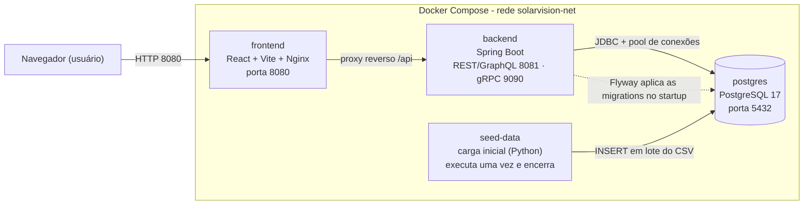

# SolarVision

Sistema full-stack para monitoramento de energia solar com microsserviços em Docker, backend em Spring Boot, banco PostgreSQL, carga inicial por CSV em Python e frontend SPA em React + Vite.

## Estrutura

```text
SolarVision/
├── backend/          # API Spring Boot + JWT + GraphQL + schema + seeder
├── frontend/         # SPA React + Vite + ApexCharts
└── docker-compose.yml
```

## Arquitetura (visão geral)



Detalhes de arquitetura (camadas, fluxos, stack e decisões) em [`docs/ARQUITETURA.md`](docs/ARQUITETURA.md) e o modelo de domínio em [`docs/MODELO-DE-CLASSES.md`](docs/MODELO-DE-CLASSES.md).

## Stack

- Backend: Java 25, Spring Boot 3.5.12, Spring Security (JWT), Spring Data JPA, Flyway, GraphQL, gRPC (Spring gRPC), springdoc-openapi (Swagger)
- Frontend: React, Vite, React Router, Axios, ApexCharts, Bootstrap
- Banco: PostgreSQL 17
- Seeder: Python 3.12 + psycopg2
- Infra: Docker Compose + Nginx

## Serviços

- `postgres`: banco principal
- `backend`: API em `http://localhost:8081`
- `frontend`: SPA em `http://localhost:8080`
- `seed-data`: carga efêmera do CSV na tabela `leituras_energia`

## Execução

```bash
docker compose up --build -d
```

## Parar

```bash
docker compose down
```

Para remover também o volume do PostgreSQL:

```bash
docker compose down -v
```

## Fluxo principal da aplicação

1. O PostgreSQL sobe vazio; o backend aplica as **migrations Flyway** (`backend/src/main/resources/db/migration`) criando o schema.
2. O backend conecta no banco e expõe REST + GraphQL em `/api/graphql`, Swagger em `/swagger-ui.html` e um servidor gRPC in-process na porta `9090`.
3. O container `seed-data` usa `backend/data-seeder/`, aguarda o schema, importa o CSV e encerra automaticamente.
4. O frontend React consome a API via Nginx reverse proxy em `/api`.

## Documentação

- Arquitetura (infra, camadas, fluxos): [`docs/ARQUITETURA.md`](docs/ARQUITETURA.md)
- Modelo de classes (domínio): [`docs/MODELO-DE-CLASSES.md`](docs/MODELO-DE-CLASSES.md)
- Funcionalidades e endpoints: [`docs/FUNCIONALIDADES.md`](docs/FUNCIONALIDADES.md)
- Decisões técnica